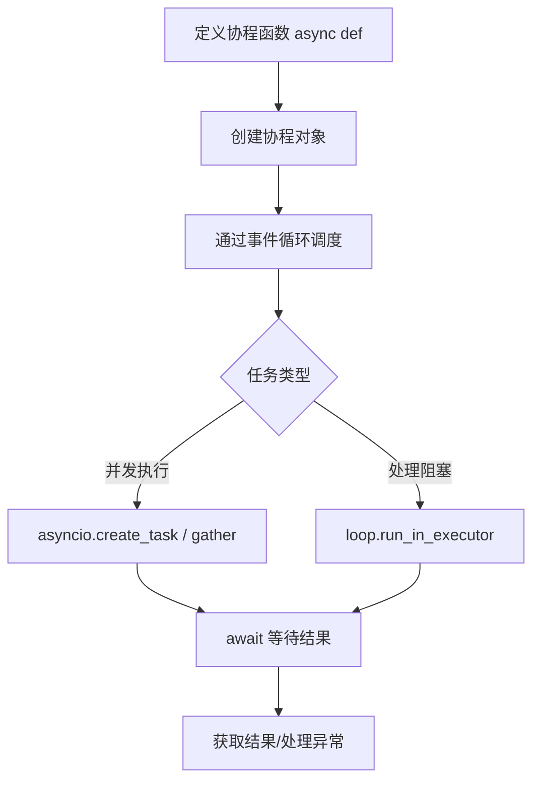

# Python 协程与 Milvus 实战

在 Python 中使用协程的核心是 **`asyncio`** ** 模块**（官方标准库，Python 3.5+ 支持），核心语法是 `async def`（定义协程函数）和 `await`（挂起协程并切换执行）。以下是 **可直接落地的步骤、代码示例和最佳实践**，覆盖从基础使用到实战场景的全流程。

## 一、核心概念快速回顾（必懂）

- **协程函数**：用 `async def` 定义的函数，调用后返回「协程对象」（而非直接执行）。

- **协程对象**：`coro = async_func()`，需通过「事件循环」调度才能执行。

- **`await`**：用于挂起当前协程，等待另一个协程/可等待对象（如 `asyncio.sleep`、网络请求）完成，期间事件循环可调度其他协程（实现并发）。

- **事件循环（Event Loop）**：协程的“调度器”，负责管理协程的启动、挂起、恢复和终止，是协程运行的核心。

## 二、基础使用：3 步跑通第一个协程

### 步骤 1：定义协程函数

用 `async def` 替代普通 `def`，内部用 `await` 调用其他可等待对象（不能用 `time.sleep`，会阻塞线程，需用 `asyncio.sleep`）。

### 步骤 2：创建协程对象

调用协程函数不会执行代码，只会返回协程对象（类似生成器）。

### 步骤 3：通过事件循环运行协程

Python 3.7+ 提供 `asyncio.run()` 简化事件循环的创建和管理（推荐优先使用）。

### 代码示例（基础版）

```Python

```

### 输出结果（并发效果）

```Plain Text

```

- 关键：两个协程同时启动，总耗时 ~1 秒（而非串行的 2 秒），体现协程的并发优势。

## 三、核心 API 详解（实战必备）

### 1. 任务创建：`create_task` vs `ensure_future`

- **`asyncio.create_task(coro)`**：Python 3.7+ 新增，优先使用，直接创建「任务」并加入事件循环，返回 `Task` 对象（可取消、查询状态）。

- **`asyncio.ensure_future(coro)`**：兼容 Python 3.5+，功能类似，但 `create_task` 更直观。

### 2. 并发等待：`gather` vs `wait`

|方法|作用|特点|
|---|---|---|
|`asyncio.gather(*coros)`|等待多个协程完成，返回结果列表|按传入顺序返回结果，一个报错则整体报错|
|`asyncio.wait(coros)`|等待多个协程完成，返回（已完成，未完成）元组|可设置超时，灵活处理部分完成的任务|
### 代码示例（`wait` 用法）

```Python

```

### 3. 阻塞操作处理：`run_in_executor`

协程中若有 **阻塞性代码**（如 `time.sleep`、同步 IO、CPU 密集型任务），会阻塞整个事件循环，需用 `loop.run_in_executor` 放到线程池/进程池执行。

#### 代码示例（处理同步阻塞函数）

```Python

```

## 四、实战场景：协程 + Milvus 向量数据库（结合你的技术栈）

协程最适合 **IO 密集型任务**（如数据库查询、网络请求），以下示例用协程并发查询 Milvus，提升效率（需安装 `pymilvus>=2.0`）。

### 步骤 1：安装依赖

```Bash

```

### 步骤 2：协程操作 Milvus 示例

```Python

```

### 关键说明

- Milvus 的 `pymilvus` 客户端目前以同步 API 为主，通过 `run_in_executor` 包装后可支持协程并发，避免单查询阻塞整体流程。

- 若 Milvus 部署在远程服务器，网络 IO 延迟越高，协程的并发优势越明显（无需等待前一个查询完成再发起下一个）。

## 五、常见问题与避坑指南

### 1. 协程中不能用 `time.sleep`

- 错误：`time.sleep(1)` 会阻塞整个事件循环，导致所有协程暂停。

- 正确：用 `await asyncio.sleep(1)`（非阻塞，挂起期间调度其他协程）。

### 2. `await` 只能在协程函数中使用

- 错误：在普通 `def` 函数中使用 `await` 会直接报错。

- 正确：要么将函数改为 `async def`，要么用 `run_in_executor` 包装同步函数。

### 3. 事件循环的线程绑定

- 一个事件循环只能在一个线程中运行，不能跨线程调用 `await`。

- 若需在多线程中使用协程，需为每个线程创建独立的事件循环（参考前文“Runnable 与协程”的线程+协程示例）。

### 4. 协程的调试

- 用 `asyncio.run()` 时，若协程报错，会自动打印堆栈信息。

- 复杂场景可使用 `asyncio.debug()` 开启调试模式：

    ```Python
    
    ```

## 六、总结：协程使用流程图


### 核心适用场景

- 网络请求（API 调用、数据库查询、消息队列）。

- IO 密集型任务（文件读写、日志收集）。

- 高并发场景（如接口限流、批量数据处理）。

通过以上步骤，你可以快速在 Python 中落地协程，并结合 Milvus 等工具提升 IO 密集型任务的并发效率。如果需要更复杂的场景（如协程池、超时重试、异常处理），可以进一步补充需求！
> （注：文档部分内容可能由 AI 生成）