# 计算机系统知识

> 系统分析师考试学习笔记 · 选择题约考 5 分

---

## 一、计算机系统概述

### 1.1 计算机系统层次结构

计算机系统分为三层：**硬件层、系统层、应用层**。

| 层次 | 说明 |
|------|------|
| 硬件层（裸机） | 硬联逻辑级（门电路、触发器）→ 微程序级（微指令集）→ 传统机器级（指令集） |
| 系统层 | 操作系统级（管理软硬件资源）+ 语言处理程序级（翻译高级/汇编语言为机器语言） |
| 应用层 | 面向用户的各种应用软件 |

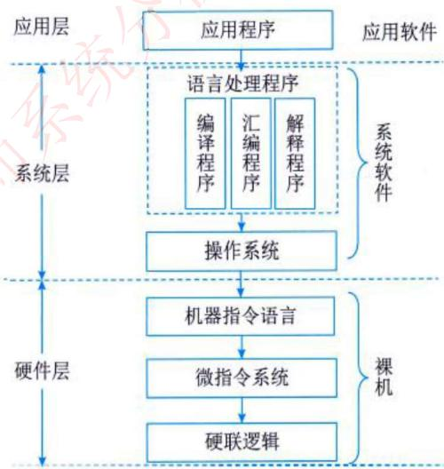

### 1.2 计算机基本硬件组成

计算机基本硬件系统由 **运算器、控制器、存储器、输入设备、输出设备** 5 大部件组成。

- **CPU**：运算器 + 控制器集成，是硬件核心，完成算术/逻辑运算及控制功能
- **存储器**：分内存（速度高、容量小、临时存储）和外存（容量大、速度慢、持久存储）
- **外部设备**：输入设备（键盘、鼠标等）+ 输出设备（显示器、打印机等）

#### CPU 的五大部件

| 部件 | 组成 | 功能 |
|------|------|------|
| 运算器 | ALU、累加寄存器(AC)、数据缓冲寄存器(DR)、状态条件寄存器(PSW) | 执行算术/逻辑运算 |
| 控制器 | 程序计数器(PC)、指令寄存器(IR)、指令译码器、时序部件 | 控制指令执行流程 |
| 寄存器组 | 通用寄存器 | 临时存储数据 |
| 内部总线 | 连接各部件 | 数据传输通路 |
| 其他部件 | 中断系统等 | 辅助功能 |

### 1.3 计算机系统软件

按功能分为**系统软件**和**应用软件**两大类：

- **系统软件**（5 类）：操作系统、语言处理程序、服务性程序、数据库管理系统、计算机网络软件
- **应用软件**：为解决具体应用问题编制的程序

> **固件（Firmware）**：存储在 **EPROM/EEPROM** 等永久性器件中的程序，介于软硬件之间。

---

## 二、校验码

### 2.1 码距

- **单个编码的码距**：只需改变一位就变成另一编码，码距为 1
- **两个编码间的码距**：从 A 码转换到 B 码所需改变的位数
- **规律**：码距越大，越利于纠错和检错

### 2.2 奇偶校验码

- 增加 1 位校验位，使编码中 1 的个数为奇数（奇校验）或偶数（偶校验），码距变为 2
- **只能检 1 位错，不能纠错**

### 2.3 循环冗余校验码（CRC）

#### 基本原理

- 在 K 位信息码后拼接 R 位校验码，总长 N = K + R
- 生成多项式 G(x) 的**最高位和最低位必须为 1**
- 接收方用 G(x) 除，余数为 0 则无错，否则有错

#### 编码流程

1. 原始信息后添加 r 个 0（r = G(x) 的阶数），作为被除数
2. 由 G(x) 得到除数（x 幂次存在的位置置 1，不存在置 0）
3. 做**模 2 除法**（不进位不借位），得余数
4. 若余数不足 r 位，左边补 0
5. 将余数附在原始信息后，即为最终发送串

**示例**：原始信息 `10110`，G(x) = x⁴+x+1（即 `10011`）

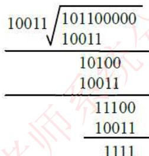

- 被除数：`101100000`（后补 4 个 0）
- 除数：`10011`
- 余数：`1111`
- 最终发送：`101101111`

> 收发双方必须使用相同的生成多项式

#### 真题示例

信息 `1100`，G(x) = x³+x+1（`1011`），求 CRC 编码：
1. 被除数：`1100000`
2. 模 2 除 `1011`，得余数 `010`
3. 最终：`1100010` → **答案 A**

### 2.4 海明码

#### 基本原理

- 在数据位之间插入 k 个校验位，扩大码距来实现**检错和纠错**
- 校验位个数满足：**2ᵏ - 1 ≥ n + k**（n 为数据位数）

#### 校验位分布规则

- 所有位从 1 开始编号（低位→高位）
- **校验位占 2 的幂次位置**：第 1、2、4、8、16… 位
- 其余位置存放数据位

**示例：信息 1011 的海明码**

| 位数 | 7 | 6 | 5 | 4 | 3 | 2 | 1 |
|------|---|---|---|---|---|---|---|
| 信息位 | I4 | I3 | I2 | - | I1 | - | - |
| 校验位 | - | - | - | r2 | - | r1 | r0 |

#### 校验位计算

将数据位编号分解为二进制（如 7=4+2+1，6=4+2，5=4+1，3=2+1）：

```
r2 = I4 ⊕ I3 ⊕ I2   （r2 负责校验含 2² 的位：4,5,6,7）
r1 = I4 ⊕ I3 ⊕ I1   （r1 负责校验含 2¹ 的位：2,3,6,7）
r0 = I4 ⊕ I2 ⊕ I1   （r0 负责校验含 2⁰ 的位：1,3,5,7）
```

代入 I4=1, I3=0, I2=1, I1=1：r2=0, r1=0, r0=1

最终海明码：**1010101**

#### 纠错原理

接收方对每组校验位做异或，结果按 r2r1r0 排列为二进制数：
- 全 0（偶校验）或全 1（奇校验）→ 无错
- 否则，二进制值指示出错位号，将该位取反即可纠错

**示例**：接收 `1011101`（第 4 位出错），计算得 r2r1r0 = **100** = 4 → 第 4 位出错 ✓

#### 真题：32 位数据需几个校验位？

2ᵏ - 1 ≥ 32 + k → k=6 时：63 ≥ 38 ✓ → **答案 D（6 个）**

---

## 三、存储系统

### 3.1 分级存储体系

**目的**：解决存储容量、成本和速度之间的矛盾。

```
速度快↑  容量小↑  价格贵↑
  CPU 寄存器
  Cache（高速缓存）
  主存（RAM/ROM）
  辅存（硬盘、光盘等）
速度慢↓  容量大↓  价格低↓
```

**两级存储**：
- Cache–主存
- 主存–辅存（虚拟存储体系）

### 3.2 局部性原理

| 类型 | 描述 |
|------|------|
| 时间局部性 | 近期被访问的数据，将来很可能再次被访问 |
| 空间局部性 | 近期访问的数据地址附近的数据，将来很可能被访问 |

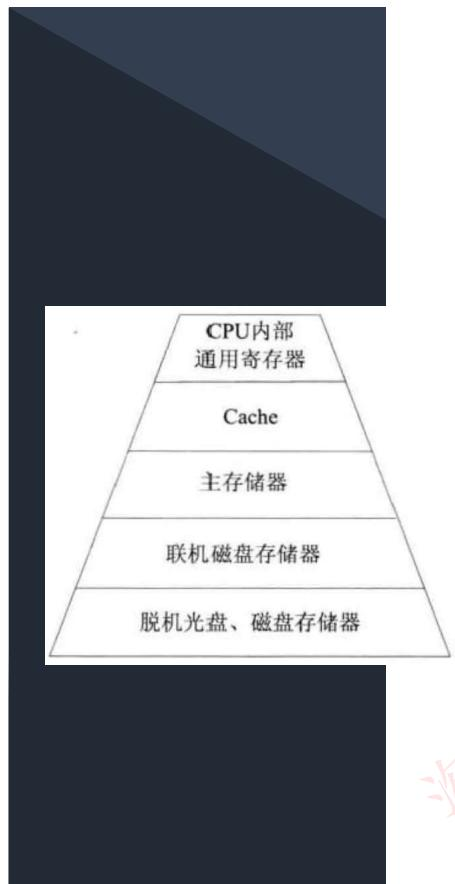

### 3.3 主存储器

主存分为 **RAM（随机存取存储器）** 和 **ROM（只读存储器）**：

| 类型           | 可读写 | 断电后  | 用途           |
| ------------ | --- | ---- | ------------ |
| DRAM（动态 RAM） | 可读写 | 数据丢失 | 主内存，需定时刷新    |
| SRAM（静态 RAM） | 可读写 | 数据丢失 | Cache，无需刷新   |
| ROM          | 只读  | 数据保留 | 存储 BIOS、固化程序 |

**存储器 4 种存取方式**：顺序存取、直接存取、随机存取、相联存取

**4 个性能指标**：存取时间、存储器带宽、存储器周期、数据传输率

### 3.4 辅助存储器

常见辅存：磁带、硬盘（HDD/SSD/SSHD）、磁盘阵列、光盘

#### 机械硬盘（HDD）结构层次

```
记录面 → 柱面（多盘片同位置磁道的集合）→ 磁道（同心圆）→ 扇区
```

**存取时间** = **寻道时间**（磁头移至目标磁道）+ **等待时间**（磁道旋转至目标扇区）  
（读写操作时间极短，可忽略不计）

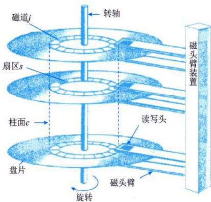

#### 磁盘调度算法

| 算法 | 全称 | 策略 | 特点 |
|------|------|------|------|
| FCFS | 先来先服务 | 按请求顺序调度 | 简单公平，但性能差 |
| SSTF | 最短寻道时间优先 | 优先距当前磁道最近的请求 | 寻道时间最短，可能产生**饥饿** |
| SCAN | 扫描（电梯）算法 | 磁头双向移动，选最近且同向的请求 | 改善饥饿，类似电梯 |
| CSCAN | 单向扫描 | 只做单向移动 | 更公平 |

**真题**：磁臂位于 21 号柱面，SSTF 算法响应序列：**②③⑧④⑥⑨①⑤⑦** → 答案 D

### 3.5 RAID 磁盘阵列

**目的**：缩小 CPU 速度与磁盘 I/O 速度之间的差距，用多个小磁盘替代单一大磁盘。

| RAID 级别  | 名称              | 特点                     |
| -------- | --------------- | ---------------------- |
| RAID 0   | 无冗余条带化          | 高 I/O 性能，无冗余，故障率高      |
| RAID 1   | 磁盘镜像            | 最高安全性，磁盘空间利用率仅 **50%** |
| RAID 2   | 海明码纠错           | 采用海明码，提供单纠错双验错         |
| RAID 3/4 | 奇偶校验（独立校验盘）     | 奇偶校验码存放在独立校验盘上         |
| RAID 5   | 分布式奇偶校验         | 奇偶校验数据分布在所有磁盘上         |
| RAID 6   | 双重分布校验          | 有两个异步校验盘，更强容错          |
| RAID 7   | 优化异步 I/O        | 最高档，所有磁盘高传输速度          |
| RAID 10  | 镜像+条带（RAID 1+0） | 先镜像再条带，兼顾性能与可靠性        |

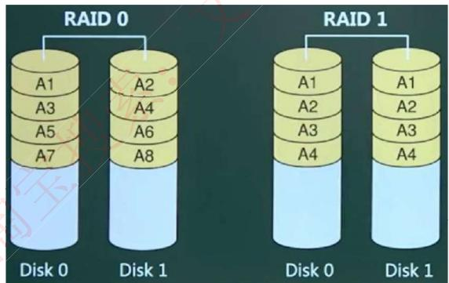

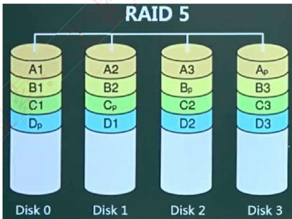

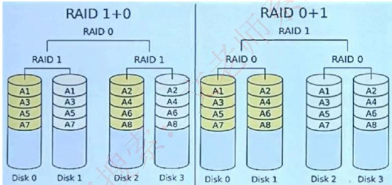

#### 光盘类型

| 类型 | 读写 |
|------|------|
| CD-ROM | 厂家预写，用户只读 |
| CD-R | 用户一次写入，多次读 |
| CD-RW | 可重复读写 |
| DVD-ROM | 大容量只读 |

### 3.6 Cache（高速缓存）

- 位于 CPU 和主存之间，速度为内存的 **5~10 倍**，容量小
- 内容是主存的副本，对程序员**透明**
- 由半导体材料构成
#### 地址映射方式

| 映射方式  | 规则                  | 优点          | 缺点              |     |
| ----- | ------------------- | ----------- | --------------- | --- |
| 直接映像  | 主存块号 = Cache 块号才能命中 | 地址变换简单      | 不灵活，块冲突概率**最高** |     |
| 全相联映像 | 主存任意块可映射到 Cache 任意块 | 块冲突概率**最低** | 地址变换复杂，速度慢      |     |
| 组相联映像 | 组间直接映像，组内全相联        | 折中方案        | 块冲突概率居中         |     |
|       |                     |             |                 |     |

**块冲突概率（高→低）**：直接映像 → 组相联映像 → 全相联映像

> Cache 与主存之间的地址映射**由硬件自动完成**，对操作系统、应用软件和程序员透明

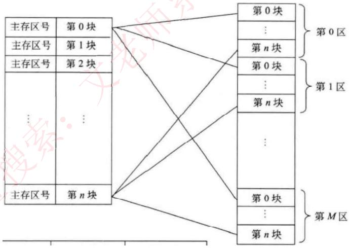

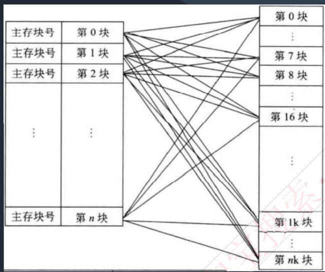

#### Cache 替换算法

| 算法          | 描述                   |
| ----------- | -------------------- |
| 随机替换        | 随机选择替换块              |
| 先进先出（FIFO）  | 替换最早进入 Cache 的块      |
| 近期最少使用（LRU） | 替换最长时间未被访问的块（**常用**） |
| 优化替换        | 需先执行程序统计信息，理论最优      |

#### 命中率与平均存取时间

$$T_{avg} = h \times T_{cache} + (1-h) \times T_{mem}$$

- h：Cache 命中率
- T_cache：Cache 存取时间
- T_mem：主存存取时间

**示例**：Cache 1ns，内存 1000ns，命中率 90%：  
T_avg = 90% × 1 + 10% × 1000 = **100.9 ns**

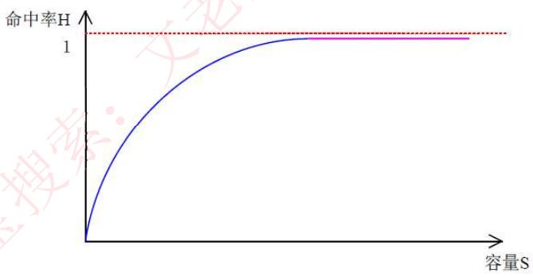

#### Cache 写操作策略

| 策略                 | 描述                           |
| ------------------ | ---------------------------- |
| 写直达（Write Through） | 数据同时写入 Cache 和内存             |
| 写回（Write Back）     | 数据只写入 Cache，淘汰时才回写内存         |
| 写一次（Write Once）    | 第一次写同时写内存（置有效位为 0），后续读时检查有效位 |

### 3.7 网络存储技术

| 类型  | 全称     | 特点                                                 |
| --- | ------ | -------------------------------------------------- |
| DAS | 直接附加存储 | SCSI 直连服务器，传输距离/连接数/速率受限                           |
| NAS | 网络附加存储 | 通过网络接口直连，独立文件服务器，支持小文件级共享，即插即用                     |
| SAN | 存储区域网  | 专用高速子网，**块级别**存储，将存储从以太网分离，支持 FC-SAN/IP-SAN/IB-SAN |

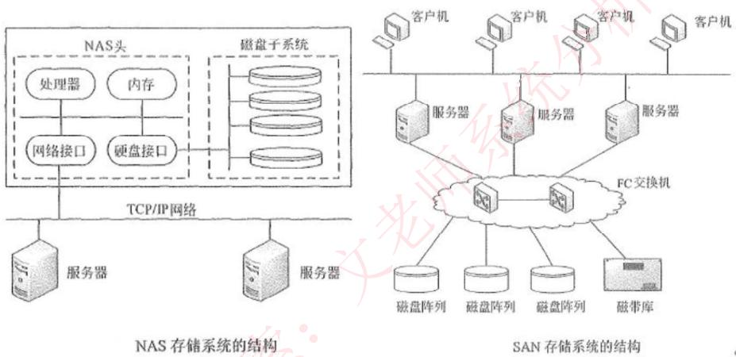

**NAS 性能特点**：小文件共享存取、支持即插即用、经济解决容量不足，但性能有限  
**SAN 特点**：块级访问、高速专用网、独立存储区域网络

### 3.8 虚拟存储技术

将多个存储介质（硬盘、RAID 等）集中管理，形成**统一的存储池**，提供大容量高性能存储。

- **存储虚拟化**：物理存储实体与逻辑表示分离，应用服务器只与逻辑卷交互

#### 拓扑结构分类

| 类型   | 描述                  |
| ---- | ------------------- |
| 对称式  | 虚拟存储控制设备内嵌在数据传输路径中  |
| 非对称式 | 虚拟存储控制设备独立于数据传输路径之外 |
#### 实现原理分类

| 类型     | 描述                          |
| ------ | --------------------------- |
| 数据块虚拟  | 解决传输冲突和延时，利用虚拟多端口并行技术，提供高带宽 |
| 虚拟文件系统 | 解决大规模网络文件共享安全机制，支持不同站点差异化权限 |
#### 实现层次

| 层次    | 实现方式                        |
| ----- | --------------------------- |
| 主机级   | 卷管理软件（纯软件），安装在应用服务器         |
| 存储设备级 | 存储控制器实现，厂商独家方案              |
| 网络级   | SAN 专用装置，管理不同厂商设备，**开放性最好** |

---
## 四、输入输出系统

### 4.1 I/O 控制方式（5 种）

| 方式          | 描述                               | CPU 参与度  |
| ----------- | -------------------------------- | -------- |
| **程序控制方式**  | CPU 执行 I/O 程序，分无条件传送和程序查询方式      | 最高（轮询等待） |
| **程序中断方式**  | 外设就绪后发中断，CPU 响应后执行中断服务程序         | 中断处理时参与  |
| **DMA 方式**  | DMA 控制器直接在主存与外设间传输，CPU 只在开始/结束介入 | 低        |
| **通道方式**    | 专用 I/O 通道，更大程度免去 CPU 介入          | 更低       |
| **I/O 处理机** | 专用外围处理机，有独立指令系统和中断系统             | 最低       |

**中断处理 5 个阶段**：中断请求 → 中断判优 → 中断响应 → 中断处理 → 中断返回

#### 通道分类

| 通道类型 | 描述 |
|----------|------|
| 字节多路通道 | 连接多台低速设备，分时共享 |
| 选择通道（高速通道） | 可连多设备，但一次只选一台独占通道 |
| 数组多路通道 | 结合字节多路和选择通道特点，有多个子通道 |

### 4.2 总线

总线（Bus）是计算机设备间传输信息的**公共数据通道**，由所有设备共享。
#### 总线分类

| 分类依据  | 类型                                                 |
| ----- | -------------------------------------------------- |
| 按功能   | 地址总线、数据总线、控制总线                                     |
| 按位置   | 机内总线、机外总线（外设接口标准）                                  |
| 按功用   | 局部总线、系统总线、通信总线                                     |
| 按数据线数 | **并行总线**（多条双向数据线，多位同时传输）、**串行总线**（单条，按位顺序传输，适合远距离） |
#### 总线性能指标（5 种）

| 指标     | 描述                               |
| ------ | -------------------------------- |
| 总线宽度   | 总线线数，影响物理空间和寻址空间                 |
| 总线带宽   | 最大数据传输速率（字节/秒），**= 总线宽度 × 总线频率** |
| 总线负载   | 连接的最大设备数量                        |
| 总线分时复用 | 同一信号线在不同时段传送不同信号                 |
| 总线猝发传输 | 一个总线周期内传输地址连续的多个数据               |

**示例**：4B/周期，1 周期 = 2 个时钟，总线 10MHz → 带宽 = 4B / (2 × 0.1μs) = **20 MB/s**

### 4.3 I/O 接口

I/O 接口（I/O 控制器）是主机与外设之间的界面。

**5 大功能**：
1. 实现主机和外设的通信联络控制
2. 地址译码和设备选择
3. 数据缓冲
4. 数据格式变换
5. 传递控制命令和状态信息

#### 串行通信方式

| 方式   | 特点                        |
| ---- | ------------------------- |
| 异步通信 | 字符间隔任意，每字符加起止位，设备简单便宜，效率低 |
| 同步通信 | 收发方同频同相，报文前附同步字符，效率高，设备复杂 |
#### 常见接口标准

| 接口        | 特点                                                            |
| --------- | ------------------------------------------------------------- |
| IDE/EIDE  | 并行 ATA，传统硬盘接口                                                 |
| SATA      | 串行，支持热插拔，传输速度快                                                |
| eSATA     | 外部 SATA，传输率 3.2Gb/s                                           |
| SCSI      | 高速，支持多种设备（含 CD-ROM）                                           |
| USB       | 串行，最多连 127 个设备；USB 1.0=12Mb/s，USB 2.0=480Mb/s，USB 3.0=4.8Gb/s |
| IEEE-1394 | 火线，高速串行接口                                                     |
| PCMCIA    | 笔记本专用，小巧灵活                                                    |
### 4.4 I/O 端口编址方式

| 方式           | 描述                         |
| ------------ | -------------------------- |
| 独立编址（I/O 映射） | 主存地址空间与端口地址空间独立，需专门 I/O 指令 |
| 统一编址（存储器映射）  | 端口地址与主存单元统一编址，用普通数据传送指令访问  |

---

## 五、指令系统

### 5.1 指令组成

一条指令 = **操作码**（决定操作类型）+ **操作数**（参与运算的数据或地址）

**指令执行过程**：
```
取指令（PC → 地址总线 → 从内存取指令存入 IR）
  → 分析指令（指令译码器解析操作码）
  → 执行指令（取源操作数并执行）
```

### 5.2 指令寻址方式

**指令地址寻址**：
- **顺序寻址**：PC 自动加 1，顺序执行
- **跳跃寻址**：下一条指令地址由当前指令给出，PC 更新

**操作数寻址**：

| 方式 | 描述 |
|------|------|
| 立即寻址 | 地址字段即操作数本身，速度最快 |
| 直接寻址 | 地址字段直接指出操作数在主存中的地址 |
| 间接寻址 | 地址字段指向的存储单元中存的是操作数的地址 |
| 寄存器寻址 | 地址字段是寄存器编号 |
| 基址寻址 | 基址寄存器内容 + 形式地址 = 有效地址，**可扩大寻址空间** |
| 变址寻址 | 变址寄存器内容 + 形式地址 = 有效地址，适合数组访问 |

### 5.3 CISC 与 RISC

| 对比项 | CISC（复杂指令集） | RISC（精简指令集） |
|--------|------------------|--------------------|
| 指令数量 | 多，使用频率差别大 | 少，使用频率接近 |
| 指令格式 | 可变长 | **定长**，大部分单周期 |
| 寻址方式 | 支持多种 | 支持方式少 |
| 实现方式 | **微程序控制（微码）** | **硬布线逻辑为主**，通用寄存器多 |
| 流水线 | 不易优化 | **适合流水线** |
| 内存操作 | 复杂指令可直接操作内存 | 只有 Load/Store 操作内存 |
| 研制周期 | 长 | 短 |
| 编译优化 | 弱 | 强（优化编译） |

**CISC 的 80-20 规律**：约 80% 的程序只用到约 20% 的指令，大量复杂指令使用率极低。

#### RISC 主要技术

| 技术 | 描述 |
|------|------|
| 延迟转移技术 | 转移指令后插入有效指令，避免流水线断流 |
| 指令取消技术 | 转移/数据变换指令可决定后续指令是否取消 |
| 重叠寄存器窗口技术 | 大寄存器堆划分多窗口，相邻过程共享部分窗口，减少参数传递开销 |
| 指令流调整技术 | 编译器分析数据流/控制流，防止流水线断流 |
| 硬布线逻辑为主 | 复杂指令用固件（固化程序）实现 |

### 5.4 体系结构分类（Flynn 分类法）

Flynn 分类法依据**指令流**和**数据流**两个因素分为 4 类：

| 类型 | 全称 | 控制部分 | 处理器 | 主存模块 | 代表 |
|------|------|---------|--------|---------|------|
| SISD | 单指令流单数据流 | 1 | 1 | 1 | 单处理器系统 |
| SIMD | 单指令流多数据流 | 1 | 多 | 多 | 并行处理机、阵列处理机、超级向量处理机 |
| MISD | 多指令流单数据流 | 多 | 多 | 多 | **理论上不存在** |
| MIMD | 多指令流多数据流 | 多 | 多 | 多 | 多处理机系统、多计算机（**当前主流多核计算机**） |

> MISD 不存在原因：一条数据流不能被多条指令同时控制（命令冲突）

**真题**：Flynn 分类法依据（**指令流和数据流**），主流多核计算机属于（**MIMD**）

---

## 六、多处理机系统

### 6.1 基本概念

- **多处理机**：≥2 个处理机，共享 I/O 子系统，在 OS 统一控制下协同工作
- **多处理机基于 MIMD**，并行处理机基于 SIMD

### 6.2 存储访问方式

| 方式 | 描述 | 耦合度 |
|------|------|--------|
| 共享存储方式 | 通过互连网络共享公共存储器（SM） | **紧耦合** |
| 分布式存储方式 | 每个处理机独占本地存储器（LM），通过互连网络通信 | **松耦合** |
### 6.3 并行处理体系结构

#### MPP（海量并行处理）

- 最重要特点：大规模并行处理
- 采用**分布式存储**，可扩展性好
- 编程困难，通信开销大
- 引入 **SVM（共享虚拟存储）**/**DSM（分布式共享存储）** 解决访问问题

#### SMP（对称多处理机 / 共享存储多处理机）

有一个统一共享的 SM，三种存储模型：

| 模型   | 全称           | 特点                          |
| ---- | ------------ | --------------------------- |
| UMA  | 均匀存储器存取      | 物理存储器被所有处理机**均匀共享**         |
| NUMA | 非均匀存储器存取     | SM 物理分布在各处理机 LM 上，访问本地快，远程慢 |
| COMA | 只用高速缓存的存储器结构 | 去掉存储器层次，全部 Cache 组成全局地址空间   |

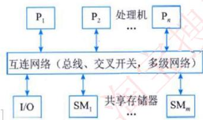

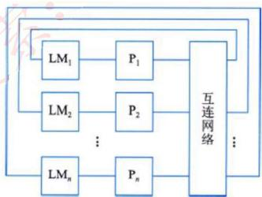

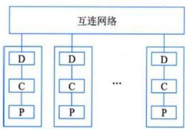

#### SMP

- 共享存储体系结构，是 SMP 在更高扩展能力方面的发展
- 本质是 **NUMA 结构**，存储器靠近处理机
- 存储带宽随处理机增加而**自动扩展**

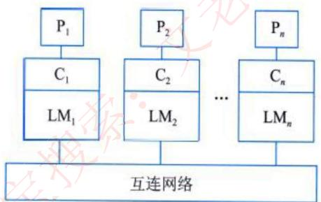

### 6.4 多处理机互连方式（5 种）

| 互连方式 | 特点 |
|----------|------|
| **总线方式** | 最简单，共享总线，**争用最严重** |
| **交叉开关** | 争用降到最低，但**连接复杂度最高** |
| **开关枢纽** | 仲裁单元（冲突处理）+ 开关单元（连接） |
| **多端口存储器** | 交叉点仲裁逻辑移至存储器，每个存储器模块有多个存取端口 |
| **多级互连网络** | MIMD/SIMD 通用，区别在于开关模块、控制方式和级间连接 |

---

## 七、计算机可靠性

### 7.1 可靠性指标

| 指标 | 含义 | 公式 |
|------|------|------|
| MTTF | 平均无故障时间 | MTTF = 1/λ（λ 为故障率） |
| MTTR | 平均修复时间 | MTTR = 1/μ（μ 为修复率） |
| MTBF | 平均故障间隔时间 | MTBF = MTTF + MTTR |
| A（可用性） | 系统正常工作的概率 | A = MTTF / (MTTF + MTTR) × 100% |

### 7.2 串并联系统可靠性

设各设备可靠性为 R₁, R₂, …, Rₙ：

**串联系统**（一个设备故障 → 整体崩溃）：
$$R = R_1 \times R_2 \times \cdots \times R_n$$


**并联系统**（所有设备故障 → 整体崩溃）：
$$R = 1 - (1-R_1) \times (1-R_2) \times \cdots \times (1-R_n)$$

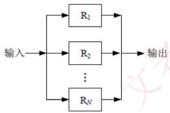

**N 模冗余系统**：由 N（N=2n+1）个相同子系统 + 表决器组成，只要 ≥ n+1 个子系统正常工作，系统即正常。

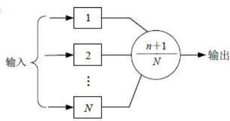

### 7.3 真题示例

> 部件 1 可靠度 0.90，部件 2、3 构成冗余系统各为 0.80，部件 4 可靠度为 x，要求系统可靠度 ≥ 0.85：

$$0.90 \times [1-(1-0.80)(1-0.80)] \times x \geq 0.85$$

解得 x 约为 **A 选项值**。

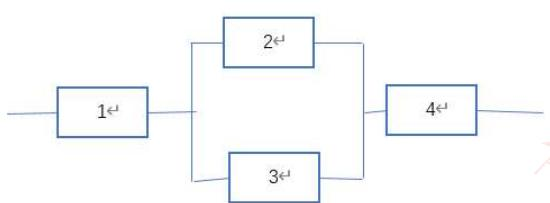

---

## 八、考点速记

| 考点 | 要点 |
|------|------|
| 码距越大 | 越利于检错纠错 |
| CRC | G(x) 最高位和最低位必须为 1；模 2 除法 |
| 海明码 | 2ᵏ-1 ≥ n+k；校验位在 2 的幂次位置 |
| 块冲突概率 | 直接映像 > 组相联 > 全相联 |
| Cache 地址映射 | 由硬件自动完成，对程序员透明 |
| 磁盘存取时间 | 寻道时间 + 等待时间（读写时间可忽略） |
| SSTF 缺点 | 可能产生饥饿现象 |
| RAID 1 | 磁盘利用率仅 50%，安全性最高 |
| RISC | 定长指令，硬布线逻辑，适合流水线，只有 Load/Store 操作内存 |
| MIMD | 当前主流多核计算机所属类别 |
| MISD | 理论上不存在 |
| SMP vs MPP | SMP 共享存储（紧耦合），MPP 分布式存储（松耦合） |
| 串联可靠性 | R = R₁ × R₂ × … × Rₙ（越串联越低） |
| 并联可靠性 | R = 1-(1-R₁)(1-R₂)…(1-Rₙ)（越并联越高） |
