# 操作系统知识

> 对应第二版教材第3.6节。第二版修改了操作系统功能定义，增加进程间通信、虚拟存储管理、文件共享和保护、文件系统安全和可靠性、作业与用户界面、国产操作系统等内容。

## 1. 操作系统概述

### 1.1 操作系统定义与特征

**操作系统定义**：能有效地组织和管理系统中的各种软/硬件资源，合理地组织计算机系统工作流程，控制程序的执行，并且向用户提供一个良好的工作环境和友好的接口。

操作系统有两个重要的作用：
1. 通过资源管理提高计算机系统的效率
2. 改善人机界面向用户提供友好的工作环境

**操作系统的4个特征**：并发性、共享性、虚拟性和不确定性。

### 1.2 操作系统的功能

1. **处理机管理**：负责对处理机的分配和运行实施有效的管理。在多道程序环境下，处理机的分配和运行是以进程为基本单位的，因此也称为进程管理。
2. **存储器管理**：主要任务是对内存进行分配、保护和扩充。
3. **设备管理**：应具有设备分配、设备传输控制和设备独立性等功能。
4. **文件管理**：负责对文件存储空间进行管理，包括存储空间的分配和回收、目录管理、文件操作管理和文件保护等功能。
5. **用户界面**：也称用户接口，是为了使用户能灵活、方便地使用计算机和系统功能，操作系统提供的一组友好的使用其功能的手段。

### 1.3 操作系统的分类

| 类型          | 特点                                           |
| ----------- | -------------------------------------------- |
| **批处理操作系统** | 单道批处理和多道批处理（主机与外设可并行）                        |
| **分时操作系统**  | 将CPU工作时间划分为许多很短的时间片，轮流为各个终端的用户服务             |
| **实时操作系统**  | 对交互能力要求不高，但要求可靠性有保障                          |
| **网络操作系统**  | 使联网计算机能方便而有效地共享网络资源，三种模式：集中模式、客户端/服务器模式、对等模式 |
| **分布式操作系统** | 系统中的计算机无主、次之分，任意两台计算机可以通过通信交换信息              |

### 1.4 嵌入式操作系统

**主要特点**：
1. **微型化**：占用的资源和系统代码量少
2. **可定制**：能运行在不同的微处理器平台上，能针对硬件变化进行结构与功能上的配置
3. **实时性**：对实时性要求较高
4. **可靠性**：系统构件、模块和体系结构必须达到应有的可靠性
5. **易移植性**：通常采用硬件抽象层和板级支撑包的底层设计技术

**嵌入式系统初始化过程**（自底向上、从硬件到软件）：
片级初始化 → 板级初始化 → 系统初始化

---

## 2. 进程管理

### 2.1 进程组成和状态

**进程的组成**：
- **进程控制块PCB**：唯一标志
- **程序**：描述进程要做什么
- **数据**：存放进程执行时所需数据

**进程三态模型**：

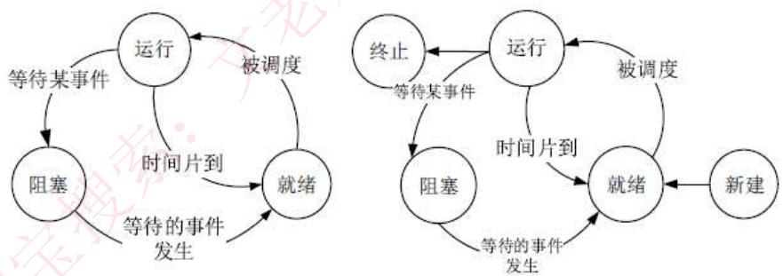

进程三种基本状态：就绪、运行、等待（阻塞）。需要熟练掌握三态之间的转换。

### 2.2 前趋图

用来表示哪些任务可以并行执行，哪些任务之间有顺序关系。

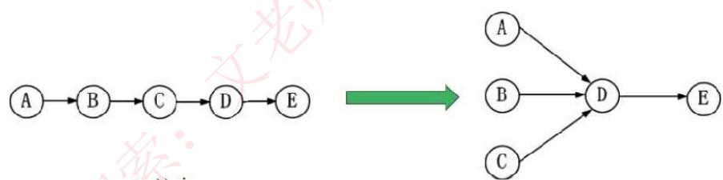

如上图所示：ABC可以并行执行，但是必须ABC都执行完后，才能执行D。

### 2.3 进程资源图

用来表示进程和资源之间的分配和请求关系。

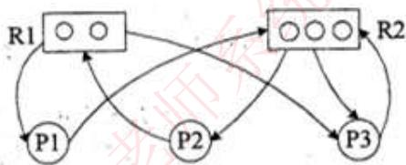

- **P代表进程**，**R代表资源**
- R方框中有几个圆球就表示有几个这种资源
- **阻塞节点**：某进程所请求的资源已经全部分配完毕，无法获取所需资源
- **非阻塞节点**：某进程所请求的资源还有剩余，可以分配给该进程继续运行

> 当一个进程资源图中所有进程都是阻塞节点时，即陷入死锁状态。

**进程资源图化简方法**：
1. 先看系统还剩下多少资源没分配
2. 再看有哪些进程是不阻塞的
3. 把不阻塞的进程的所有边都去掉，形成一个孤立的点
4. 把系统分配给这个进程的资源回收回来
5. 重复上述过程，直到所有资源和进程都变成孤立的点

**真题示例**：

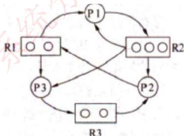

> 解析：P3是不阻塞的（有资源可分配），故P3为化简的开始。把P3孤立，回收分配给它的资源，P1也变为不阻塞节点。化简顺序为P3→P1→P2。

### 2.4 进程同步与互斥

**基本概念**：
- **临界资源**：各进程间需要以互斥方式对其进行访问的资源
- **临界区**：指进程中对临界资源实施操作的那段程序（本质是一段程序代码）
- **互斥**：某资源在同一时间内只能由一个任务单独使用，使用时需要加锁
- **同步**：多个任务可以并发执行，只不过有速度上的差异，在一定情况下停下等待

**信号量机制**：
- **互斥信号量**：对临界资源采用互斥访问，初值为1
- **同步信号量**：对共享资源的访问控制，初值一般是共享资源的数量

**P操作和V操作**：

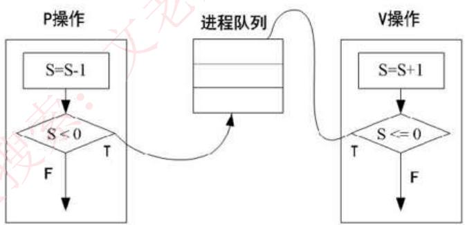

- **P操作**：S=S-1，若S<0则置该进程为阻塞状态
- **V操作**：S=S+1，若S<=0则从阻塞状态唤醒一个进程

**经典问题：生产者与消费者问题**

三个信号量：
- **S0**（互斥信号量）：仓库独立使用权
- **S1**（同步信号量）：仓库空闲个数
- **S2**（同步信号量）：仓库商品个数

```
生产者流程：           消费者流程：
生产一个商品s          P(S0)
P(S0)                  P(S2)
P(S1)                  取出一个商品
将商品放入仓库中       V(S1)
V(S2)                  V(S0)
V(S0)
```

### 2.5 进程间通信

进程间通信根据交换信息量的多少和效率的高低，分为低级方式和高级方式。

**PV操作的问题**：
1. 编程难度大，通信对用户不透明
2. 使用不当容易引起死锁

**高级通信方式**：
1. **共享存储模式**：相互通信的进程可以共享某些数据结构（或存储区）实现进程之间的通信
2. **消息传递模式**：进程间的数据交换以消息为单位，利用系统提供的一组通信命令（原语）来实现通信
3. **管道通信**：用于连接一个读进程和一个写进程，以实现它们之间通信的共享文件（pipe文件）

### 2.6 死锁

**定义**：当一个**进程**在等待永远不可能发生的事件时，就会产生死锁。若系统中有多个进程处于死锁状态，就会造成**系统**死锁。

**死锁产生的四个必要条件**：
1. 资源互斥
2. 每个进程占有资源并等待其他资源
3. 系统不能剥夺进程资源
4. 进程资源图是一个环路

**死锁解决方法**：

| 方法 | 说明 |
|------|------|
| **死锁预防** | 采用某种策略限制并发进程对于资源的请求，破坏死锁产生的四个条件之一 |
| **死锁避免** | 采用银行家算法，提前计算出一条不会死锁的资源分配方法 |
| **死锁检测** | 允许死锁产生，但系统定时运行一个检测死锁的程序 |
| **死锁解除** | 死锁发生后的解除方法，如强制剥夺资源、撤销进程等 |

**死锁资源计算公式**：
系统内有n个进程，每个进程都需要R个资源，那么其发生死锁的最大资源数为 `n*(R-1)`，不发生死锁的最小资源数为 `n*(R-1)+1`。

**真题示例**：

某系统中有3个并发进程竞争资源R，每个进程都需要5个R，那么至少有( )个R，才能保证系统不会发生死锁。

A. 12  B. 13  C. 14  D. 15

> 答案：B
> 
> 解析：每个进程需要5个R才能执行，则当每个进程都只有4个R时是死锁最坏的情况，即3×4=12个资源是死锁发生的最大资源数，再加1就能保证不发生死锁，因此是13。

**银行家算法真题**：

T0时刻系统中有P1、P2、P3、P4和P5五个进程，这些进程对资源的最大需求和已分配资源数如下表所示：

| 资源进程 | 最大需求量 R1 R2 R3 | 已分配资源数 R1 R2 R3 |
|---------|-------------------|---------------------|
| P1 | 5 3 1 | 1 1 1 |
| P2 | 3 2 0 | 2 1 0 |
| P3 | 6 1 1 | 3 1 0 |
| P4 | 3 3 2 | 1 1 1 |
| P5 | 2 1 1 | 1 1 0 |

系统资源总数为 R1=10, R2=5, R3=3。此时系统剩余的可用资源数分别为( )。如果进程按( )序列执行，那么系统状态是安全的。

> 答案：可用资源为 (2, 0, 1)，安全序列为 P5→P2→P4→P3→P1
> 
> 解析：计算可用资源 = 总资源 - 已分配资源之和。然后使用银行家算法找出安全序列。

### 2.7 线程

**引入线程的原因**：进程在创建、撤销和切换中，系统必须为之付出较大的时空开销，限制了并发程度的提高。

**线程的特点**：
- 线程作为调度和分配的基本单位
- 进程作为独立分配资源的单位
- 线程基本上不拥有资源，只拥有一点运行中必不可少的资源（如程序计数器、一组寄存器和栈）
- 可与同属一个进程的其他线程共享进程所拥有的全部资源

---

## 3. 存储管理

### 3.1 分区存储管理

所谓分区存储组织，就是整存，将某进程运行所需的内存整体一起分配给它。

**三种分区方式**：

| 方式         | 特点                       | 问题      |
| ---------- | ------------------------ | ------- |
| **固定分区**   | 静态分区方法，将主存分为若干个固定的分区     | 会产生内部碎片 |
| **可变分区**   | 动态分区方法，分区是在作业转入时划分       | 会产生外部碎片 |
| **可重定位分区** | 移动所有已经分配好的区域，使其成为一个连续的区域 | 解决碎片问题  |

**可变分区分配算法**：

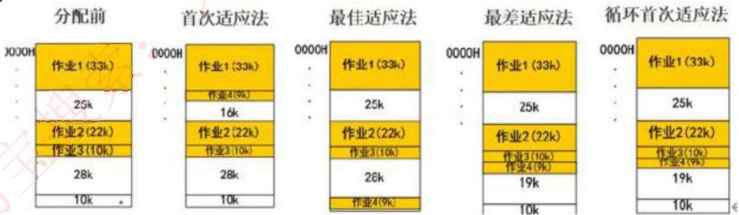

- **首次适应法**：按内存地址顺序从头查找，找到第一个满足要求的空闲块
- **最佳适应法**：将内存中所有空闲内存块按从小到大排序，找到与需求大小最相近的空闲块
- **最差适应法**：将内存中空闲块空间最大的切割分配给进程
- **循环首次适应法**：按内存地址顺序查找，找到第一个满足要求的空闲块，下次从下一个位置开始查找

### 3.2 分页存储管理

逻辑页分为页号和页内地址，页内地址就是物理偏移地址，而页号与物理块号需要查询页表才能对应。

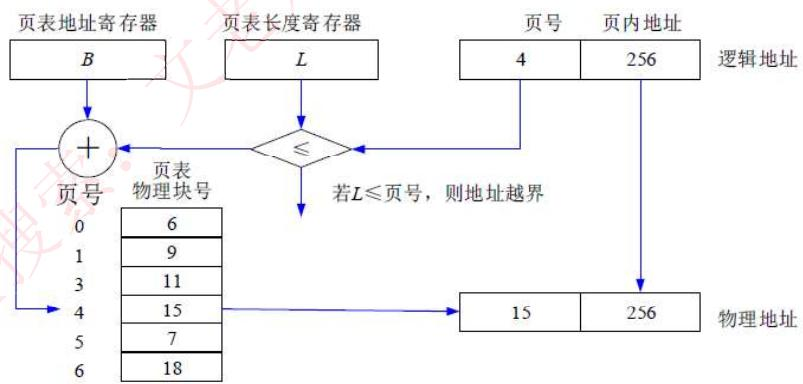

**优点**：利用率高，碎片小，分配及管理简单
**缺点**：增加了系统开销，可能产生抖动现象

**页面置换算法**：

| 算法 | 说明 |
|------|------|
| **最优算法(OPT)** | 理论上的算法，选择未来最长时间内不被访问的页面置换 |
| **先进先出算法(FIFO)** | 先调入内存的页先被置换淘汰，会产生抖动现象 |
| **最近最少使用(LRU)** | 过去最少使用的页面被置换淘汰，效率高且不会产生抖动 |

> **淘汰原则**：优先淘汰最近未访问的，而后淘汰最近未被修改的页面。

**快表**：
- 是一块小容量的相联存储器，由快速存储器组成，按内容访问
- 快表是将页表存于Cache中；慢表是将页表存于内存上
- 慢表需要访问两次内存才能取出页，而快表是访问一次Cache和一次内存

### 3.3 分段存储管理

将进程空间分为一个个段，每段有段号和段内地址。与页式存储不同的是，每段物理大小不同，分段是根据逻辑整体分段的。

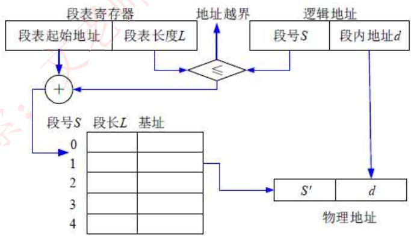

**段表内容**：段长和基址两个属性，才能确定一个逻辑段在物理段中的位置。

**优点**：多道程序共享内存，各段程序修改互不影响
**缺点**：内存利用率低，内存碎片浪费大

### 3.4 段页式存储管理

对进程空间先分段，后分页。

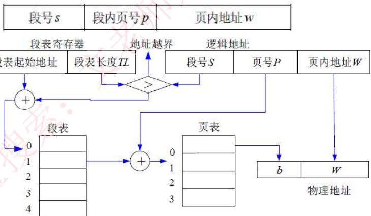

**优点**：空间浪费小、存储共享容易、存储保护容易、能动态链接
**缺点**：复杂性和开销增加，需要的硬件以及占用的内容也有所增加，执行速度下降

### 3.5 虚拟存储管理

**定义**：如果一个作业只部分装入主存便可开始启动运行，其余部分暂时留在磁盘上，在需要时再装入主存。从用户角度看，该系统所具有的主存容量将比实际主存容量大得多。

**关键概念**：
- **缺页率**：程序在运行中所产生的缺页情况会影响程序的运行速度及系统性能
- **颠簸（抖动）**：进程频繁地从辅存请求页面而出现的现象
- **工作集**：当每个工作集都已达到最小值时，虚存管理程序跟踪进程的缺页数量

**虚拟存储器的特点**：
- 具有请求调入功能和置换功能
- 仅把作业的一部分装入主存便可运行作业
- 能从逻辑上对主存容量进行扩充
- 逻辑容量由主存和外存容量之和以及CPU可寻址的范围来决定

---

## 4. 设备管理

### 4.1 设备管理概述

**I/O系统组成**：设备、控制器、通道（具有通道的计算机系统）、总线和I/O软件。

**设备的分类**：
- 按数据组织分类：块设备、字符设备
- 按设备功能分类：输入设备、输出设备、存储设备、网络联网设备、供电设备
- 资源分配角度分类：独占设备、共享设备和虚拟设备
- 数据传输速率分类：低速设备、中速设备、高速设备

**设备管理的主要功能**：
- 动态地掌握并记录设备的状态
- 设备分配和释放
- 缓冲区管理
- 实现物理I/O设备的操作
- 提供设备使用的用户接口及设备的访问和控制

### 4.2 I/O软件层次

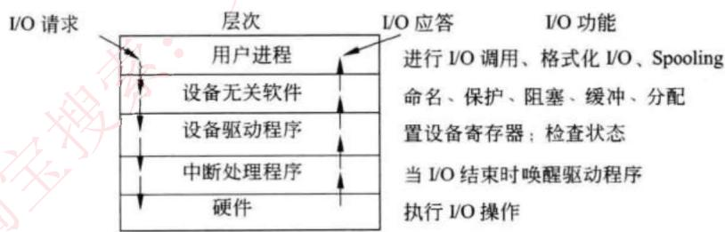

**层次结构**（从上到下）：
1. 用户进程层
2. 与设备无关的软件层
3. 设备驱动程序
4. 中断处理程序
5. 硬件

### 4.3 SPOOLING技术

引入SPOOLING（外围设备联机操作）技术，在外设上建立两个数据缓冲区：
- **输入井**：用于输入数据缓冲
- **输出井**：用于输出数据缓冲

这样无论多少进程，都可以共用一台打印机，实现了物理外设的共享，使得每个进程都感觉在使用一个打印机，这就是物理设备的虚拟化。

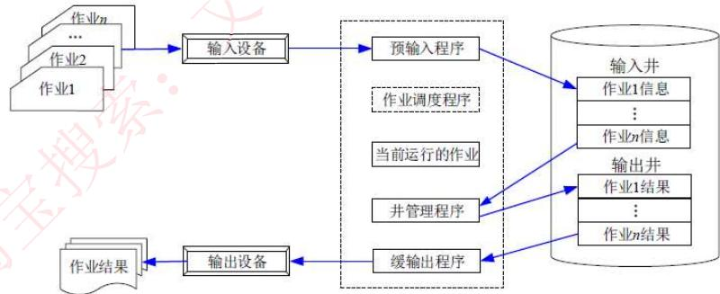

---

## 5. 文件管理

### 5.1 文件管理概述

**文件定义**：具有符号名的、在逻辑上具有完整意义的一组相关信息项的集合。

**文件系统功能**：
- 按名存取
- 统一的用户接口
- 并发访问和控制
- 安全性控制
- 优化性能
- 差错恢复

**文件的类型**：
1. 按文件性质和用途：系统文件、库文件和用户文件
2. 按信息保存期限：临时文件、档案文件和永久文件
3. 按文件的保护方式：只读文件、读/写文件、可执行文件和不保护文件
4. UNIX系统分类：普通文件、目录文件和设备文件（特殊文件）

**文件的逻辑结构**：
- 有结构的记录式文件
- 无结构的流式文件

**文件的物理结构**：

| 结构 | 说明 |
|------|------|
| **连续结构** | 将逻辑上连续的文件信息依次存放在连续编号的物理块上 |
| **链接结构** | 将逻辑上连续的文件信息存放在不连续的物理块上，每个物理块设有一个指针指向下一个物理块 |
| **索引结构** | 将逻辑上连续的文件信息存放在不连续的物理块中，系统为每个文件建立一张索引表 |

### 5.2 索引文件结构

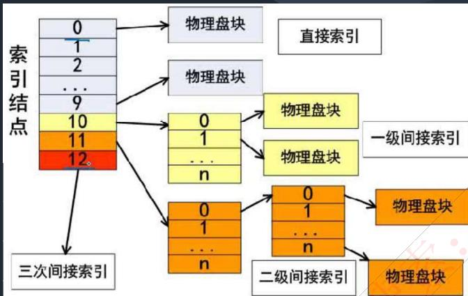

系统中有13个索引节点：
- **0-9**：直接索引，每个索引节点存放的是内容
- **10号**：一级间接索引节点，存放的是链接到直接物理盘块的地址
- **11号**：二级间接索引节点
- **12号**：三级间接索引节点

假设每个物理盘大小为4KB，每个地址占4B：
- 直接索引容量：4KB × 10 = 40KB
- 一级间接索引容量：1024 × 4KB = 4096KB
- 二级间接索引容量：1024 × 1024 × 4KB

### 5.3 文件目录

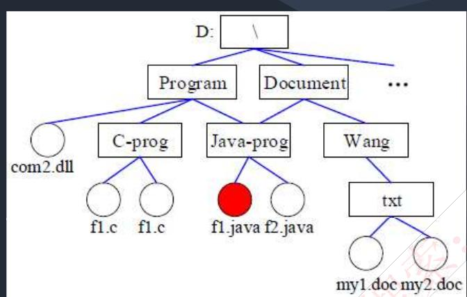

**文件控制块(FCB)** 包含三类信息：
1. **基本信息类**：文件名、文件的物理地址、文件长度和文件块数等
2. **存取控制信息类**：文件的存取权限（如UNIX的RWX）
3. **使用信息类**：文件建立日期、最后一次修改日期、最后一次访问的日期等

**路径类型**：
- **相对路径**：从当前路径开始的路径
- **绝对路径**：从根目录开始的路径
- **全文件名** = 绝对路径 + 文件名

### 5.4 文件存储空间管理

**文件的存取方法**：
- **顺序存取**：对文件中的信息按顺序依次进行读/写
- **随机存取**：对文件中的信息可以按任意的次序随机地读/写

**文件存储空间的管理方法**：

| 方法 | 说明 |
|------|------|
| **空闲区表** | 将外存空间上的连续未分配区域称为"空闲区"，建立空闲表，适用于连续文件结构 |
| **位示图** | 每一位对应文件存储器上的一个物理块，取值0和1分别表示空闲和占用 |
| **空闲块链** | 每个空闲物理块中有指向下一个空闲物理块的指针，所有空闲物理块构成一个链表 |
| **成组链接法** | 将空闲块分成若干组，每组的第一个空闲块登记了下一组空闲块的物理盘块号和空闲块总数 |


### 5.5 文件的共享和保护

**文件链接方式**：
- **硬链接**：将两个文件目录表目指向同一个索引结点
- **符号链接**：建立新的文件或目录，并与原来文件或目录的路径名进行映射

**存取控制方法**：

| 方法 | 说明 |
|------|------|
| **存取控制矩阵** | 二维矩阵，一维列出计算机的全部用户，另一维列出系统中的全部文件 |
| **存取控制表** | 按用户对文件的访问权限的差别对用户进行分类 |
| **用户权限表** | 以用户或用户组为单位，将用户可存取的文件集中起来存入表中 |
| **密码** | 在创建文件时由用户提供一个密码，存入磁盘时用该密码对文件内容加密 |

### 5.6 文件的安全和可靠性

**安全性管理（4个级别）**：
1. 系统级
2. 用户级
3. 目录级
4. 文件级

**可靠性保护方法**：
- 转储和恢复
- 日志文件
- 文件系统的一致性检查（块的一致性检查和文件的一致性检查）

---

## 6. 作业与用户界面

### 6.1 作业管理

**作业定义**：系统为完成一个用户的计算任务（或一次事务处理）所做的工作总和。

**作业控制方式**：
- **脱机控制**：一次性提交作业说明书给系统
- **联机控制**：用户输入命令的人机交互

**作业组成**：程序、数据和作业说明书。

**作业状态及转换**：

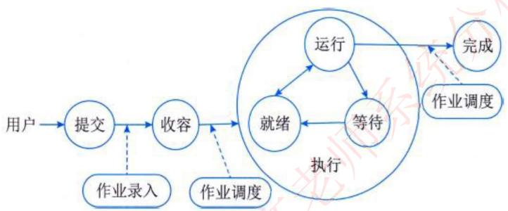

1. **提交**：作业处于输入设备进入外部存储设备的过程
2. **后备**：通过Spooling系统将作业输入到计算机系统的后备存储器中，随时等待作业调度程序调度
3. **执行**：作业被作业调度程序选中，为其分配了必要的资源，并为其建立相应的进程
4. **完成**：作业正常结束或异常终止，由作业调度程序进行善后处理

**作业控制块(JCB)**：记录与该作业有关的各种信息的登记表，是作业存在的唯一标志。

**常用作业调度算法**：
- 先来先服务
- 短作业优先
- 优先级调度算法
- 响应比高优先

**响应比计算公式**：
```
响应比 = 作业响应时间 / 作业执行时间
其中：作业响应时间 = 作业进入系统后的等待时间 + 作业的执行时间
```

### 6.2 用户界面

**定义**：计算机中实现用户与计算机通信的软/硬件部分的总称。

**操作系统提供的接口**：
- 命令接口
- 程序接口
- 图形界面接口

**用户界面的发展阶段**：
1. 控制面板式用户界面
2. 字符用户界面
3. 图形用户界面
4. 新一代用户界面

**新一代用户界面的特征**：
- 以用户为中心
- 自然、高效、高带宽
- 非精确、无地点限制
- 技术支持：多媒体、多通道及智能化

---

## 7. 国产操作系统

国产操作系统主要以开源的Linux为基础进行二次开发：

| 操作系统 | 简介 |
|----------|------|
| **银河麒麟(KylinOS)** | 目标是打破国外操作系统的垄断，包括实时版、安全版、服务器版 |
| **deepin** | 基于Linux发行版，支持笔记本、台式机和一体机 |
| **统信UOS** | 基于deepin进行深度开发，目前已是一款较为完善的系统 |
| **中标麒麟** | 采用强化的Linux内核，分桌面版、通用版、高级版和安全版等 |
| **红旗Linux** | 国产Linux发行版 |
| **安超OS2020** | 基于服务器架构的通用型云操作系统，具有软硬件解耦、应用优化等特点 |
| **中科方德** | 基于核高基（核心电子器件、高端通用芯片及基础软件产品）桌面操作系统基础版 |
| **StartOs(起点)** | 从Linux底层构建，拥有完全自主的核心配置及特色 |

---

## 相关资源

- [[../01-cs-fundamentals/operating-systems|计算机基础 - 操作系统]]
- [[01-computer-systems|计算机系统知识]]
- [[03-database-systems|数据库系统]]
