# 数据库系统

## 1. 数据库系统概述

### 1.1 基本概念

**数据**：是数据库中存储的基本对象，是描述事物的符号记录。数据的种类包括文本、图形、图像、音频、视频等。

**数据库（DB）**：是长期存储在计算机内、有组织的、可共享的大量数据的集合。

**数据库的基本特征**：
- 数据按一定的数据模型组织、描述和存储
- 可为各种用户共享
- 冗余度较小
- 数据独立性较高
- 易扩展

**数据库系统（DBS）**：是一个采用了数据库技术，有组织地、动态地存储大量相关数据，方便多用户访问的计算机系统。由以下四个部分组成：

| 组成部分 | 说明                                |
| ---- | --------------------------------- |
| 数据库  | 统一管理、长期存储在计算机内的，有组织的相关数据的集合       |
| 硬件   | 构成计算机系统包括存储数据所需的外部设备              |
| 软件   | 操作系统、数据库管理系统及应用程序                 |
| 人员   | 系统分析和数据库设计人员、应用程序员、最终用户、数据库管理员DBA |

**数据库管理系统（DBMS）的功能**：
- 实现对共享数据有效的组织、管理和存取
- 包括数据定义、数据库操作、数据库运行管理、数据的存储管理、数据库的建立和维护等

### 1.2 三级模式-两级映像

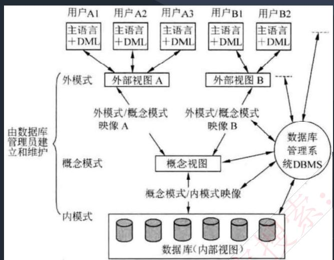

| 模式           | 说明                               | 对应   |
| ------------ | -------------------------------- | ---- |
| **内模式**      | 管理如何存储物理的数据，对应具体物理存储文件           | 存储文件 |
| **模式（概念模式）** | 通常使用的基本表，根据应用、需求将物理数据划分成一张张表     | 基本表  |
| **外模式**      | 对应数据库中的视图这个级别，将表进行一定的处理后再提供给用户使用 | 视图   |

**两级映像**：
- **外模式-模式映像**：是表和视图之间的映射，存在于概念级和外部级之间。若表中数据发生了修改，只需要修改此映射，而无需修改应用程序（保证**逻辑独立性**）
- **模式-内模式映像**：是表和数据的物理存储之间的映射，存在于概念级和内部级之间。若修改了数据存储方式，只需要修改此映射，而不需要去修改应用程序（保证**物理独立性**）

> **考试真题**：在数据库系统中，数据库的视图、基本表和存储文件的结构分别与（外模式、模式、内模式）对应；数据的物理独立性和数据的逻辑独立性是分别通过修改（模式与内模式之间的映像、外模式与模式之间的映像）来完成的。

## 2. 数据库设计与建模

### 2.1 数据库设计阶段

基于数据库系统生命周期的数据库设计可分为如下5个阶段：

| 阶段 | 主要任务 | 产出物 |
|------|---------|--------|
| **规划阶段** | 进行建立数据库的必要性及可行性分析，确定数据库系统在企业和信息系统中的地位 | 可行性分析报告 |
| **需求分析** | 通过调查研究，了解用户的数据和处理要求 | 需求说明书、数据流图、数据字典等 |
| **概念设计** | 在需求说明书的基础上，抽象为一个不依赖于任何DBMS的数据模型（概念模型） | E-R图 |
| **逻辑设计** | 将概念模型转化为某个特定的DBMS上的逻辑模型 | 关系模式 |
| **物理设计** | 对给定的逻辑模型选取一个最适合应用环境的物理结构 | 物理存储方案 |

### 2.2 E-R图合并冲突

各局部E-R图之间的冲突主要有三类：

| 冲突类型 | 说明 |
|---------|------|
| **属性冲突** | 包括属性域冲突和属性取值冲突 |
| **命名冲突** | 同名异义和异名同义 |
| **结构冲突** | 同一对象在不同应用中具有不同的抽象；同一实体在不同局部E-R图中所包含的属性个数和属性排列次序不完全相同 |

### 2.3 数据模型

**E-R模型（实体-联系模型）**：

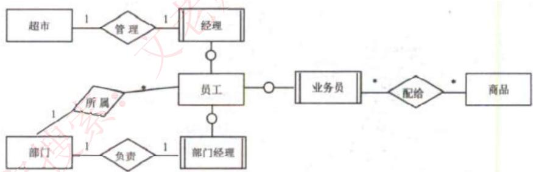

**E-R图表示法**：
- **椭圆**：表示属性
- **长方形**：表示实体
- **菱形**：表示联系
- **联系两端**：填写联系类型（1:1、1:N、M:N）

**实体类型**：
- **实体**：客观存在并可相互区别的事物
- **弱实体**：依赖于强实体的存在而存在
- **实体集**：具有相同类型和共享相同属性的实体的集合

**属性分类**：
- 简单属性和复合属性
- 单值属性和多值属性
- NULL属性
- 派生属性

**联系类型**：

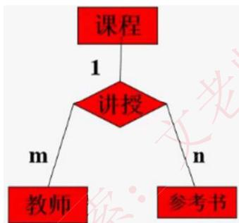

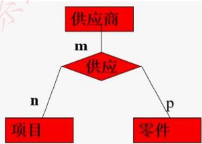

**关系模型**：

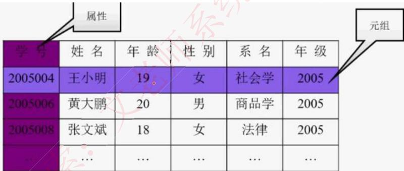

关系模型中数据的逻辑结构是一张二维表，由行列组成。用表格结构表达实体集，用外键标识实体间的联系。

**关系模型优缺点**：
- **优点**：建立在严格的数学概念基础上；概念单一、结构简单、清晰，用户易懂易用；存取路径对用户透明，数据独立性、安全性好
- **缺点**：由于存取路径透明，查询效率往往不如非关系数据模型

**数据模型三要素**：
1. **数据结构**：所研究的对象类型的集合
2. **数据操作**：对数据库中各种对象的实例允许执行的操作的集合
3. **数据的约束条件**：一组完整性规则的集合

### 2.4 E-R模型转换为关系模型

| 联系类型 | 转换方法 |
|---------|---------|
| **1:1联系** | 联系可以放到任意的两端实体中，作为一个属性；也可以转换为一个单独的关系模式 |
| **1:N联系** | 联系可以单独作为一个关系模式，也可以在N端中加入1端实体的主键 |
| **M:N联系** | 联系必须作为一个单独的关系模式，其主键是M和N端的联合主键 |

## 3. 关系代数

### 3.1 基本运算

**并（∪）**：结果是两张表中所有记录数合并，相同记录只显示一次。

**交（∩）**：结果是两张表中相同的记录。

**差（-）**：S1-S2，结果是S1中有而S2中没有的记录。

**笛卡尔积（×）**：产生的结果包括S1和S2的所有属性列，并且S1中每条记录依次和S2中所有记录组合成一条记录，最终属性列为S1+S2属性列，记录数为S1×S2。

### 3.2 专门的关系运算

**投影（π）**：按条件选择某关系模式中的某列，列也可以用数字表示。

**选择（σ）**：按条件选择某关系模式中的某条记录。

**自然连接（⋈）**：结果显示全部的属性列，但是相同属性列只显示一次，显示两个关系模式中属性相同且值相同的记录。

> **示例**：设有关系R(A,B,C)和S(A,C,D)，自然连接结果包含A、B、C、D四列，只显示R.C=S.C且R.A=S.A的记录。

## 4. 关系数据库的规范化

### 4.1 函数依赖

**定义**：给定一个X，能唯一确定一个Y，就称X确定Y，或者说Y依赖于X。

**函数依赖类型**：
- **部分函数依赖**：A→C，(A,B)→C，A就能决定C，称为部分函数依赖
- **传递函数依赖**：A→B，B→C，则A→C为传递函数依赖（若A和B等价，则不存在传递）

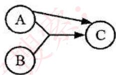

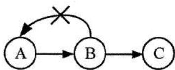

**Armstrong公理**：
- **自反律**：若Y⊆X⊆U，则X→Y为F所逻辑蕴含
- **增广律**：若X→Y为F所逻辑蕴含，且Z⊆U，则XZ→YZ为F所逻辑蕴含
- **传递律**：若X→Y和Y→Z为F所逻辑蕴含，则X→Z为F所逻辑蕴含
- **合并规则**：若X→Y，X→Z，则X→YZ为F所蕴涵
- **伪传递率**：若X→Y，WY→Z，则XW→Z为F所蕴涵
- **分解规则**：若X→Y，Z⊆Y，则X→Z为F所蕴涵

### 4.2 键与约束

| 概念 | 说明 |
|------|------|
| **超键** | 能唯一标识此表的属性的组合 |
| **候选键** | 超键中去掉冗余的属性，剩余的属性就是候选键 |
| **主键** | 任选一个候选键，即可作为主键 |
| **外键** | 其他表中的主键 |
| **主属性** | 候选键内的属性为主属性，其他属性为非主属性 |

**完整性约束**：
- **实体完整性约束**：即主键约束，主键值不能为空，也不能重复
- **参照完整性约束**：即外键约束，外键必须是其他表中已经存在的主键的值，或者为空
- **用户自定义完整性约束**：自定义表达式约束，如设定年龄属性的值必须在0到150

### 4.3 范式

**第一范式（1NF）**：关系中的每一个分量必须是一个不可分的数据项。通俗地说，第一范式就是表中不允许有小表的存在。

**第二范式（2NF）**：如果关系R属于1NF，且每一个非主属性完全函数依赖于任何一个候选码，则R属于2NF。通俗地说，2NF就是在1NF的基础上，表中的每一个非主属性不会依赖复合主键中的某一个列。

**第三范式（3NF）**：在满足1NF的基础上，表中不存在非主属性对码的传递依赖。

**BC范式（BCNF）**：在第三范式的基础上进一步消除主属性对于码的部分函数依赖和传递依赖。通俗的来说，就是在每一种情况下，每一个依赖的左边决定因素都必然包含候选键。

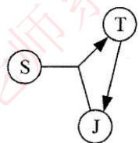

### 4.4 模式分解

**保持函数依赖分解**：对于关系模式R，有依赖集F，若对R进行分解，分解出来的多个关系模式，保持原来的依赖集不变，则为保持函数依赖的分解。

**无损分解**：分解后的关系模式能够还原出原关系模式，就是无损分解，不能还原就是有损。

**判断无损分解（两个关系模式）**：
若R分解为ρ={R1,R2}，F是R的函数依赖集，如果R1∩R2→R1-R2 或 R1∩R2→R2-R1，则ρ是无损分解。

## 5. 事务并发和封锁协议

### 5.1 事务的ACID特性

| 特性 | 说明 |
|------|------|
| **原子性（Atomicity）** | 要么全做，要么全不做 |
| **一致性（Consistency）** | 事务发生后数据是一致的 |
| **隔离性（Isolation）** | 任一事务的更新操作直到其成功提交的整个过程对其他事务都是不可见的 |
| **持续性（Durability）** | 事务操作的结果是持续性的 |

### 5.2 并发控制问题

| 问题 | 说明 |
|------|------|
| **丢失更新** | 事务1对数据A进行了修改并写回，事务2也对A进行了修改并写回，事务2写回的数据会覆盖事务1写回的数据 |
| **不可重复读** | 事务2读A，而后事务1对数据A进行了修改并写回，此时若事务2再读A，发现数据不对 |
| **读脏数据** | 事务1对数据A进行了修改后，事务2读数据A，而后事务1回滚，数据A恢复了原来的值，事务2读到了脏数据 |

### 5.3 封锁协议

**锁的类型**：
- **X锁（排它锁/写锁）**：若事务T对数据对象A加上X锁，则只允许T读取和修改A，其他事务都不能再对A加任何类型的锁
- **S锁（共享锁/读锁）**：若事务T对数据对象A加上S锁，则只允许T读取A，但不能修改A，其他事务只能再对A加S锁

**三级封锁协议**：

| 级别 | 说明 | 解决问题 |
|------|------|---------|
| **一级封锁协议** | 事务在修改数据R之前必须先对其加X锁，直到事务结束才释放 | 丢失更新 |
| **二级封锁协议** | 一级封锁协议的基础上加上事务T在读数据R之前必须先对其加S锁，读完后即可释放S锁 | 丢失更新、读脏数据 |
| **三级封锁协议** | 一级封锁协议加上事务T在读取数据R之前先对其加S锁，直到事务结束才释放 | 丢失更新、读脏数据、不可重复读 |

## 6. 数据库安全与恢复

### 6.1 数据库安全措施

| 措施 | 说明 |
|------|------|
| **用户标识和鉴定** | 最外层的安全保护措施，可以使用用户帐户、口令及随机数检验等方式 |
| **存取控制** | 对用户进行授权，包括操作类型和数据对象的权限 |
| **密码存储和传输** | 对远程终端信息用密码传输 |
| **视图的保护** | 对视图进行授权 |
| **审计** | 使用一个专用文件或数据库，自动将用户对数据库的所有操作记录下来 |

### 6.2 备份与恢复

**备份类型**：

| 类型 | 说明 | 特点 |
|------|------|------|
| **静态转储（冷备份）** | 转储期间不允许对数据库进行任何存取、修改操作 | 快速、容易归档；只能提供到某一时间点上的恢复 |
| **动态转储（热备份）** | 转储期间允许对数据库进行存取、修改操作 | 可在表空间或数据库文件级备份；不能出错 |
| **完全备份** | 备份所有数据 | - |
| **差量备份** | 仅备份上一次完全备份之后变化的数据 | - |
| **增量备份** | 备份上一次备份之后变化的数据 | - |

**故障恢复**：

| 故障类型 | 故障原因 | 解决方法 |
|---------|---------|---------|
| **事务本身的可预期故障** | 本身逻辑 | 在程序中预先设置Rollback语句 |
| **事务本身的不可预期故障** | 算术溢出、违反存储保护 | 由DBMS的恢复子系统通过日志，撤消事务对数据库的修改 |
| **系统故障** | 系统停止运转 | 通常使用检查点法 |
| **介质故障** | 外存被破坏 | 一般使用日志重做业务 |

**数据故障的恢复步骤**：
1. **事务故障恢复**：反向扫描日志文件，查找该事务的更新操作，执行逆操作，直至读到事务的开始标记
2. **系统故障恢复**：正向扫描日志文件，找出已提交的事务记入Redo队列，未完成的事务记入Undo队列，分别进行重做或撤销处理
3. **介质故障恢复**：装入最新的数据库后援副本，从故障点开始反向扫描日志文件，根据Redo队列重做已完成的任务

## 7. 数据库性能优化

### 7.1 优化策略

1. **硬件升级**：处理器、内存、磁盘子系统和网络
2. **数据库设计优化**：逻辑设计和物理设计
3. **索引优化策略**
4. **查询优化**

### 7.2 逻辑设计常用措施

- 将常用的计算属性存储到数据库实体中
- 重新定义实体，以减少外部属性数据或行数据的开支
- 将关系进行水平或垂直分割，以提升并行访问度

### 7.3 索引优化策略

- 建立索引时，应选用经常作为查询，而不常更新的属性
- UPDATE、INSERT、DELETE都必须跟着做相应的调整
- 尽量分析出每个重要查询的使用频率
- 对于数据量非常小的关系不必建立索引

### 7.4 查询优化

- 建立物化视图或尽可能减少多表查询
- 以不相干子查询替代相干子查询
- 只检索需要的属性
- 用带IN的条件子句等价替换OR子句
- 经常提交(COMMIT)，以尽早释放锁

### 7.5 反规范化技术

**反规范化**：规范化设计后，数据库设计者希望牺牲部分规范化来提高性能。

**益处**：降低连接操作的需求、降低外码和索引的数目，还可能减少表的数目，能够提高查询效率。

**可能带来的问题**：数据的重复存储，浪费了磁盘空间；可能出现数据的完整性问题，增加了数据维护的复杂性，会降低修改速度。

**具体方法**：
1. **增加冗余列**：在多个表中保留相同的列
2. **增加派生列**：在表中增加可以由本表或其它表中数据计算生成的列
3. **重新组表**：把两个表重新组成一个表来减少连接
4. **水平分割表**：根据一列或多列数据的值，把数据放到多个独立的表中
5. **垂直分割表**：将主键与部分列放到一个表中，主键与其它列放到另一个表中

## 8. 分布式数据库

### 8.1 分布式数据库特点

1. **数据独立性**：除了数据的逻辑独立性与物理独立性外，还有数据分布独立性(分布透明性)
2. **集中与自治共享结合的控制结构**：各局部的DBMS可以独立地管理局部数据库，同时设有集中控制机制
3. **适当增加数据冗余度**：在不同的场地存储同一数据的多个副本，提高系统的可靠性和可用性
4. **全局的一致性、可串行性和可恢复性**

### 8.2 分布式数据库体系结构

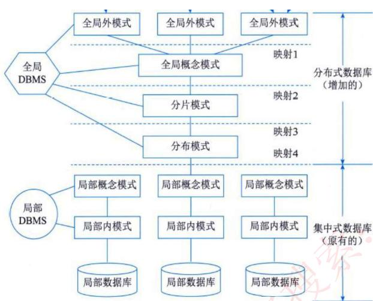

| 层次 | 说明 |
|------|------|
| **全局外模式** | 全局应用的用户视图，是全局概念模式的子集 |
| **全局概念模式** | 定义分布式数据库中数据的整体逻辑结构 |
| **分片模式** | 将数据库整体逻辑结构分解为合适的逻辑单位（片段） |
| **分布模式** | 定义数据片段的存放节点 |
| **局部概念模式** | 局部数据库的概念模式 |
| **局部内模式** | 局部数据库的内模式 |

### 8.3 分片方式

| 分片方式 | 说明 |
|---------|------|
| **水平分片** | 将一个全局关系中的元组分裂成多个子集，重构通过关系的并操作实现 |
| **垂直分片** | 将一个全局关系按属性分裂成多个子集，重构通过连接运算实现 |
| **导出分片** | 水平分片的条件不是本关系属性的条件，而是其他关系属性的条件 |
| **混合分片** | 在分片中采用水平分片和垂直分片两种形式的混合 |

### 8.4 分布透明性

| 透明性类型 | 说明 |
|-----------|------|
| **分片透明性** | 用户或应用程序不需要知道逻辑上访问的表具体是如何分块存储的 |
| **位置透明性** | 应用程序不关心数据存储物理位置的改变 |
| **逻辑透明性** | 用户或应用程序无需知道局部使用的是哪种数据模型 |
| **复制透明性** | 用户或应用程序不关心复制的数据从何而来 |

## 9. 数据仓库与数据挖掘

### 9.1 数据仓库

**数据仓库定义**：是一个面向主题的、集成的、非易失的、且随时间变化的数据集合，用于支持管理决策。

**数据仓库特征**：

| 特征 | 说明 |
|------|------|
| **面向主题** | 按照一定的主题域进行组织的 |
| **集成的** | 数据是在对原有分散的数据库数据抽取、清理的基础上经过系统加工、汇总和整理得到的 |
| **相对稳定的** | 数据主要供企业决策分析之用，所涉及的数据操作主要是数据查询 |
| **反映历史变化** | 数据通常包含历史信息，记录了企业从过去某一时点到目前的各个阶段的信息 |

**数据仓库的结构**：

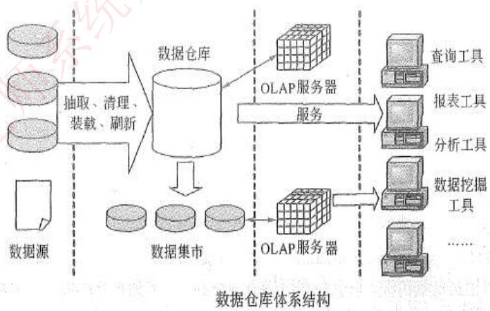

1. **数据源**：是数据仓库系统的基础，是整个系统的数据源泉
2. **数据的存储与管理**：是整个数据仓库系统的核心
3. **OLAP服务器**：对分析需要的数据进行有效集成，按多维模型组织
4. **前端工具**：报表工具、查询工具、数据分析工具、数据挖掘工具等

**数据仓库的分类**：
- **企业仓库**：面向企业级应用，搜集了企业的各个主题的所有信息
- **数据集市**：面向企业部门级应用，包含对特定用户有用的、企业范围数据的一个子集
  - 从属数据集市：数据直接来自于中央数据仓库
  - 独立数据集市：数据直接来自于业务系统
- **虚拟仓库**：是操作型数据库上视图的集合

**数据仓库的设计方法**：
1. **自顶向下的方法**：由总体规划和设计开始，建立企业级数据仓库
2. **自底向上的方法**：从企业中最关键的部门开始，先产生独立数据集市
3. **混合法**：自顶向下和自底向上的方法联合使用

### 9.2 商业智能（BI）

BI系统主要包括四个主要阶段：
1. **数据预处理**：包括数据的抽取(Extraction)、转换(Transformation)和加载(Load)，即ETL过程
2. **建立数据仓库**：处理海量数据的基础
3. **数据分析**：采用联机分析处理（OLAP）和数据挖掘两大技术
4. **数据展现**：保障系统分析结果的可视化

### 9.3 数据挖掘

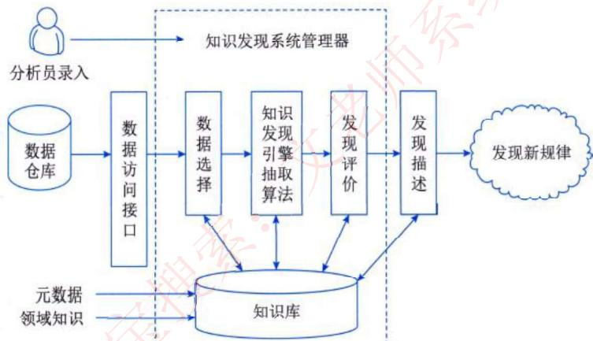

**数据挖掘的常用技术**：

| 技术 | 说明 |
|------|------|
| **决策树方法** | 利用信息论中的互信息寻找数据库中具有最大信息量的属性 |
| **分类方法** | 将数据按照含义划分成组 |
| **粗糙集方法** | 基于分类，通过上近似概念和下近似概念来表示不精确概念 |
| **神经网络** | 通过学习待分析数据中的模式来构造模型 |
| **关联规则** | 搜索业务系统中的所有细节和事务，找出重复出现概率很高的模式 |
| **遗传算法** | 模拟生物进化过程的算法，由繁殖、交叉和变异三个基本算子组成 |
| **可视化分析** | 给出带有多变量的图形化分析数据 |

**数据挖掘的分析方法**：
- **关联分析**：发现不同事件之间的关联性
- **序列分析**：发现一定时间间隔内接连发生的事件
- **分类分析**：为每个记录赋予一个标记，按标记分类记录
- **聚类分析**：将本身没有类别的样本聚集成不同的组
- **预测方法**：根据样本的已知特征估算某个连续类型的变量的取值
- **时间序列分析**：预测未来发展趋势，或者寻找相似发展模式

## 10. 非关系数据库（NoSQL）

### 10.1 NoSQL数据库分类

| 分类 | 典型产品 | 应用场景 | 优点 | 缺点 |
|------|---------|---------|------|------|
| **文档存储** | MongoDB、CouchDB | Web应用，存储面向文档和半结构化数据 | 结构灵活，可以根据value构建索引 | 缺乏统一的查询语法，无事务处理能力 |
| **键值存储** | Memcached、Redis | 内容缓存，如会话、配置文件、参数等 | 扩展性好，灵活性强，大量操作时性能高 | 数据无结构化，通常被当成字符串或者二进制数据 |
| **列存储** | BigTable、HBase、Cassandra | 分布式数据存储和管理 | 可扩展性强，查找速度快，复杂性低 | 功能局限，不支持事务的强一致性 |
| **图存储** | Neo4j、OrientDB | 社交网络、推荐系统 | 支持复杂的图形算法 | 复杂性高，只能支持一定的数据规模 |

### 10.2 CAP理论

**CAP三要素**：
- **一致性（Consistency）**：所有的结点在同一时刻有相同的数据
- **可用性（Availability）**：任何请求不管成功或失败都有响应
- **分区容忍性（Partition tolerance）**：在网络发生故障的时候，允许系统继续工作

**BASE理论**：
- **Basic Availability**：基本可用
- **Soft State**：软状态
- **Eventual Consistency**：最终一致性

> 如果选择了CP（一致性和分区容忍性），就要考虑ACID。如果选择了AP（可用性和分区容忍性），就要考虑BASE。

### 10.3 存储布局

**行存储和列存储**：
- **行存储**：将每条记录的所有字段的数据聚合存储，适用于OLTP、更新操作频繁的场合
- **列存储**：将所有记录中相同字段的数据聚合存储，适用于OLAP、数据仓库、数据挖掘等查询密集型应用

**列存储的优点**：
1. 每个字段的数据聚集存储，在查询只需要少数几个字段的时候能大大减少读取的数据量
2. 更容易为这种聚集存储设计更好的压缩/解压算法

## 11. SQL语言

### 11.1 基本语法

**数据定义**：
```sql
-- 创建表
CREATE TABLE S(
    Sno CHAR(5) NOT NULL UNIQUE,
    Sname CHAR(30) UNIQUE,
    Status CHAR(8),
    City CHAR(20),
    PRIMARY KEY(Sno)
);

-- 修改表
ALTER TABLE S ADD Zap CHAR(6);

-- 删除表
DROP TABLE Student;

-- 创建索引
CREATE UNIQUE INDEX S_SNO ON S(Sno);

-- 创建视图
CREATE VIEW CS_STUDENT AS ...
```

**数据查询**：
```sql
SELECT [ALL|DISTINCT] <目标列表达式>[,<目标列表达式>]...
FROM <表名或视图名>[,<表名或视图名>]
[WHERE <条件表达式>]
[GROUP BY <列名1> [HAVING <条件表达式>]]
[ORDER BY <列名2> [ASC|DESC]]
```

**常用关键字**：
- **DISTINCT**：过滤重复的选项，只保留一条记录
- **UNION**：对两个SQL语句的查询结果做或运算
- **INTERSECT**：对两个SQL语句的查询结果做与运算
- **LIKE**：模糊查询，`%`表示任意字符，`_`表示单个字符

**聚合函数**：
- MIN、MAX、AVG、SUM、COUNT

## 12. 考试真题精选

### 真题1：三级模式
在数据库系统中，数据库的视图、基本表和存储文件的结构分别与（**外模式、模式、内模式**）对应；数据的物理独立性和数据的逻辑独立性是分别通过修改（**模式与内模式之间的映像、外模式与模式之间的映像**）来完成的。

### 真题2：范式判断
某销售公司数据库的零件关系P(零件号，零件名称，供应商，供应商所在地，库存量)，函数依赖集F={零件号→零件名称，(零件号，供应商)→供应商所在地，(零件号，供应商)→库存量}，则P属于（**1NF**）。

> 解析：依题意，基于函数依赖集F，零件P关系中的(零件号，供应商)可决定零件P关系的所有属性，因此零件P关系的主键为(零件号，供应商)。又因为"(零件号，供应商)→零件名称"，而"零件号→零件名称"、"供应商→供应商所在地"，由此可知零件名称和供应商所在地都部分依赖于码，所以关系模式P∈1NF。

### 真题3：事务特性
"当多个事务并发执行时，任一事务的更新操作直到其成功提交的整个过程对其他事务都是不可见的"，这一性质通常被称为事务的（**隔离性**）。

### 真题4：数据库恢复
为了保证数据库中数据的安全可靠和正确有效，系统在进行事务处理时，对数据的插入、删除或修改的全部有关内容先写入（**日志文件**）；当系统正常运行时，按一定的时间间隔，把数据库缓冲区内容写入（**数据文件**）；当发生故障时，根据现场数据内容及相关文件来恢复系统的状态。

### 真题5：数据仓库特点
数据仓库中数据（**相对稳定性**）的特点是指数据一旦进入数据仓库后，将被长期保留并定期加载和刷新，可以进行各种查询操作，但很少对数据进行修改和删除操作。
