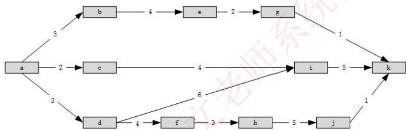

# 项目管理

> **考试重点**：本章内容自从2018年之后几乎没考过，学员重点掌握进度管理的计算即可，其他内容了解即可。

## 1 项目管理概述

项目管理包括以下主要知识领域：

- 范围管理
- 进度管理
- 预算与成本管理
- 配置管理
- 质量管理
- 人力资源管理
- 风险管理

## 2 范围管理

### 2.1 范围管理概述

**范围管理**就是要确定项目的边界，也就是说，要确定哪些工作是本次项目应该做的，哪些工作不应该包括在本次项目中。这个过程用于确保项目干系人对作为项目结果的产品（或服务），以及开发这些产品所确定的过程有一个共同的理解。

### 2.2 范围计划的编制

范围计划编制的成果就是**范围管理计划**。范围管理计划是对项目的范围进行确定、记载、核实管理和控制的行动指南。范围管理计划包括：

- 如何进行项目范围定义
- 如何制订工作分解结构（WBS）
- 如何进行项目范围核实和控制等

### 2.3 创建工作分解结构

**WBS（工作分解结构）**把项目整体或者主要的可交付成果分解成容易管理、方便控制的若干个子项目，子项目需要继续分解为工作包。持续这个过程，直到整个项目都分解为可管理的工作包，这些工作包的总和就是项目的所有工作范围。

**创建WBS的目的**：详细规定项目的范围，建立范围基准。

### 2.4 范围确认与控制

**范围确认**主要是确认项目的可交付成果是否满足项目干系人的要求。把项目的可交付成果列表提交给项目干系人，同时，也应该展示项目的进度安排。

**范围控制**必须能够对造成范围变更的因素施加影响，估算对项目的资金、进度和风险等的影响。以保证变化是有利的。同时，需要判断范围变更是否发生，如果已经发生，则要对变更进行管理。

## 3 进度管理

### 3.1 进度管理概述

**进度管理**就是采用科学的方法，确定进度目标，编制进度计划和资源供应计划，进行进度控制，在与质量、成本目标协调的基础上，实现工期目标。

### 3.2 进度管理过程

进度管理包括以下6个过程：

1. **活动定义**：确定完成项目各项可交付成果而需要开展的具体活动
2. **活动排序**：识别和记录各项活动之间的先后关系和逻辑关系
3. **活动资源估算**：估算完成各项活动所需要的资源类型和效益
4. **活动历时估算**：估算完成各项活动所需要的具体时间
5. **进度计划编制**：分析活动顺序、活动持续时间、资源要求和进度制约因素，制订项目进度计划
6. **进度控制**：根据进度计划开展项目活动，如果发现偏差，则分析原因或进行调整

### 3.3 活动排序

#### 3.3.1 前导图法（PDM）

**前导图法（PDM）**用方格或矩形（节点）表示活动，用箭线表示依赖关系。在PDM中，每项活动都有唯一的活动号，注明了预计工期。

**PDM包括4种依赖关系**：

| 依赖关系 | 英文名称 | 说明 |
|---------|---------|------|
| 完成对开始 | FS (Finish-to-Start) | 后一活动的开始要等到前一活动的完成 |
| 完成对完成 | FF (Finish-to-Finish) | 后一活动的完成要等到前一活动的完成 |
| 开始对开始 | SS (Start-to-Start) | 后一活动的开始要等到前一活动的开始 |
| 开始对完成 | SF (Start-to-Finish) | 后一活动的完成要等到前一活动的开始 |

#### 3.3.2 箭线图法（ADM）

**箭线图法（ADM）**用节点表示事件，用箭线表示活动，并在节点处将其连接起来，以表示依赖关系。

- 活动的开始（箭尾）事件叫做该活动的**紧前事件**
- 活动的结束（箭头）事件叫做该活动的**紧后事件**

**ADM的三个基本原则**：

1. 每一个事件必须有唯一的代号，即ADM中不会有相同的代号
2. 任何两项活动的紧前事件和紧后事件代号至少有一个不相同，节点序号沿箭线方向越来越大
3. 流入（流出）同一事件的活动，均有共同的后继活动（或先行活动）

#### 3.3.3 依赖关系类型

| 依赖关系类型 | 别名 | 说明 |
|-------------|------|------|
| 强制性依赖关系 | 硬逻辑关系、工艺关系 | 活动固有的依赖关系，这种关系是活动之间本身存在的、无法改变的逻辑关系 |
| 可自由处理的依赖关系 | 软逻辑关系、组织关系、首选逻辑关系、优先逻辑关系 | 人为确定的一种先后关系 |
| 外部依赖关系 | - | 这种关系涉及项目与非项目活动之间的关系 |

#### 3.3.4 逻辑关系表达形式

| 形式 | 说明 |
|------|------|
| 平行关系 | 也称为并行关系，两项活动同时开始即为平行关系 |
| 顺序关系 | 相邻两项活动先后进行即为顺序关系 |
| 搭接关系 | 两项活动只有一段时间是平行进行的则称为搭接关系 |

### 3.4 活动资源估算

活动资源估算的主要方法：

1. **专家判断法**：由项目管理专家根据以往类似项目的经验和对本项目的判断，经过周密思考，进行合理预测，从而估算出项目资源
2. **替换方案的确定**：资源估算是为了给项目预算明确空间，为早期的资源筹备提供数据，如果某项活动存在替代方案，或提供的资源有替代支持可能，则需要明确声明
3. **公开的估算数据**：有些公司会定期地公开一些生产率或人工费率数据，其中包括很多国家和地区的劳动力交易、材料和设备信息
4. **估算软件**：依靠软件的强大功能，可以定义资源可用性、费率，以及不同的资源日历
5. **自下而上的估算**：把复杂的活动分解为更小的工作，以便于资源估算。将每项工作所需要的资源估算出来，然后汇总即是整个活动所需要的资源数量

### 3.5 活动历时估算

#### 3.5.1 软件项目规模度量

- **代码行（LOC）**：软件项目通常用代码行来衡量项目规模，LOC指所有可执行的源代码行数
- **功能点（FP）估算**：在需求分析阶段基于系统功能的一种规模估计方法

#### 3.5.2 估算方法

| 方法 | 说明 |
|------|------|
| **德尔菲（Delphi）法** | 当前比较流行的专家评估技术，该方法结合了专家判断法和三点估算法，在没有历史数据的情况下，对项目进行估算 |
| **类比估算法** | 适合评估一些与历史项目在应用领域、环境和复杂度等方面相似的项目，通过新项目与历史项目的比较得到规模估计 |
| **功能点（FP）估算** | 通过研究初始应用需求，确定各种输入、输出、数据文件、查询和外部接口，以及一些复杂度调整值 |

#### 3.5.3 COCOMO模型

**COCOMO模型**：常见的软件规模估算方法。以代码行数估算出每个程序员工作量，累加得软件成本。

**模型按详细程度分为三级**：

1. **基本COCOMO模型**：静态单变量模型，用已估算出来的源代码行数（LOC）为自变量的经验函数计算软件开发工作量
2. **中级COCOMO模型**：在基本模型的基础上，再用涉及产品、硬件、人员、项目等方面的影响因素调整工作量的估算
3. **高级COCOMO模型**：将系统、子系统和模块3个层次，更进一步考虑了软件工程中每一步骤（如分析、设计）的影响

**COCOMOⅡ模型**：COCOMO的升级，以软件规模作为成本的主要因素，考虑多个成本驱动因子。包含三种不同规模估算选择：对象点、功能点和代码行。

### 3.6 进度控制

#### 3.6.1 进度偏差分析

当出现进度偏差时，需要分析该偏差对后续活动及总工期的影响。主要从以下几方面进行分析：

1. 分析产生进度偏差的活动是否为关键活动
2. 分析进度偏差是否大于总时差
3. 分析进度偏差是否大于自由时差

**调整原则**：

- 为关键路径活动、大于总时差，都需要调整
- 小于总时差，但大于自由时差，可能对后续活动有影响
- 小于自由时差，无需调整

#### 3.6.2 项目进度计划的调整

1. **关键活动的调整**
   - 第一种情况：关键活动的实际进度较计划进度提前时的调整方法
     - 若仅要求按计划工期执行，则可利用该机会降低资源强度及费用
     - 若要求缩短工期，则应将计划的未完成部分作为一个新的计划，重新计算与调整，按新的计划执行
   - 第二种情况：关键活动的实际进度较计划进度落后时的调整方法
     - 缩短后续关键活动的持续时间

2. **非关键活动的调整**
   - 在总时差范围内延长非关键活动的持续时间
   - 缩短工作的持续时间
   - 调整工作的开始或完成时间

3. **增减工作项目**
   - 增加工作项目：只对原遗漏或不具体的逻辑关系进行补充
   - 减少工作项目：只是对提前完成的工作项目或原不应设置的工作项目予以消除

4. **资源调整**：若资源供应发生异常时，应进行资源调整。资源调整的方法是进行资源优化，提高资源利用率

### 3.7 关键路径法

#### 3.7.1 关键路径概念

**关键路径**：是项目的最短工期，但却是从开始到结束时间最长的路径。进度网络图中可能有多条关键路径，因为活动会变化，因此关键路径也在不断变化中。

**关键活动**：关键路径上的活动，最早开始时间 = 最晚开始时间。

#### 3.7.2 时间参数

每个节点的活动会有如下时间参数：

| 时间参数 | 英文名称 | 说明 |
|---------|---------|------|
| 最早开始时间 | ES (Early Start) | 某项活动能够开始的最早时间 |
| 最早完成时间 | EF (Early Finish) | EF = ES + 持续时间 |
| 最迟结束时间 | LF (Late Finish) | 为了使项目按时完成，某项活动必须完成的最迟时间 |
| 最迟开始时间 | LS (Late Start) | LS = LF - 持续时间 |

**计算方法**：

- **顺推**：
  - 最早开始 ES = 所有前置活动最早完成 EF 的最大值
  - 最早完成 EF = 最早开始 ES + 持续时间

- **逆推**：
  - 最晚完成 LF = 所有后续活动最晚开始 LS 的最小值
  - 最晚开始 LS = 最晚完成 LF - 持续时间

#### 3.7.3 浮动时间

**总浮动时间**：在不延误项目完工时间且不违反进度制约因素的前提下，活动可以从最早开始时间推迟或拖延的时间量，就是该活动的进度灵活性。

```
总浮动时间 = LS - ES = LF - EF = 非关键路径时长
```

**自由浮动时间**：是指在不延误任何紧后活动的最早开始时间且不违反进度制约因素的前提下，活动可以从最早开始时间推迟或拖延的时间量。

```
自由浮动时间 = 紧后活动最早开始时间的最小值 - 本活动的最早完成时间
```

### 3.8 考试真题

**真题1**：

下图中（单位：周）显示的项目历时总时长是（）周。在项目实施过程中，活动d-i比计划延期了2周，活动a-c实际工期是6周，活动f-h比计划提前了1周，此时该项目的历时总时长为（）周。



选项：A.14  B.18  C.16  D.13

> **答案**：C、C
> 
> **解析**：关键路径是最长的一条路径。题干的图示并不复杂，所以直接可以数出来，发现路径adfhjk是最长的，所以他是关键路径，总时长用路径的活动周期相加即可，等于16。题干所说的实施过程，影响了3条路径，分别是acik，adik和原来的关键路径adfhjk。按照其调整后计算：acik=15，adik=16，adfhjk=15，所以总时长仍为16。

**真题2**：

某项目包含A、B、C、D、E、F、G七个活动，各活动的历时估算和逻辑关系如下表所示，则活动c的总浮动时间是（）天，项目工期是（）天。

| 活动名称 | 紧前活动 | 活动历时 |
|---------|---------|---------|
| A | - | 2 |
| B | A | 4 |
| C | A | 5 |
| D | A | 6 |
| E | B C | 4 |
| F | D | 6 |
| G | E F | 3 |

选项：A.0  B.1  C.2  D.3（第一空）；A.14  B.15  C.16  D.17（第二空）

> **答案**：D、D
> 
> **解析**：根据表格列举出各路径长度：
> - ABEG = 2+4+4+3 = 13
> - ACEG = 2+5+4+3 = 14
> - ADFG = 2+6+6+3 = 17（关键路径）
> 
> 项目工期 = 17天
> 
> 活动C的总浮动时间 = 关键路径时长 - 经过C的路径时长 = 17 - 14 = 3天

## 4 预算与成本管理

### 4.1 成本管理概述

**项目成本管理**是在整个项目的实施过程中，为确保项目在批准的预算条件下尽可能保质按期完成，而对所需的各个过程进行管理与控制。

项目成本管理包括：**成本估算**、**成本预算**和**成本控制**。

### 4.2 成本估算方法

| 方法 | 说明 |
|------|------|
| **自顶向下估算** | 从项目的整体出发，进行类推 |
| **自底向上估算** | 把系统进行细分，直到每一个子任务都已经明确所需要的开发工作量，然后把它们加起来，得到系统开发的总工作量 |
| **差别估算法** | 综合了自顶向下估算和自底向上估算的优点，把项目与过去已完成的项目进行类比，从其开发的各个子任务中区分出类似的部分和不同的部分 |

### 4.3 成本预算

**成本预算**是进行项目成本控制的基础，是将估算的成本分配到项目的各项具体工作上，以确定项目各项工作和活动的成本定额，制订项目成本的控制标准，规定项目意外成本的划分与使用规则。

**成本预算的基本步骤**：

1. 分摊项目总成本到WBS的各个工作包中，为每个工作包建立总预算成本
2. 将每个工作包分配得到的成本再二次分配到工作包所包含的各项活动上
3. 确定各项成本预算支出的时间计划，以及每个时间点对应的累积预算成本，编制项目成本预算计划

### 4.4 成本预算考虑因素

在进行成本预算时，除了要考虑项目的直接成本，还要考虑其间接成本和对成本有影响的其他因素：

| 因素 | 说明 |
|------|------|
| **非直接成本** | 包括租金、保险和其他管理费用 |
| **隐没成本（沉没成本）** | 已经付出且不可收回的成本 |
| **学习曲线** | 项目组成员有一个学习的过程，许多时间和劳动投入到尝试和试验中 |
| **项目完成的时限** | 一般来说，项目需要完成的时限越短，那么成本就越高 |
| **质量要求** | 成本估算要根据产品质量要求的不同而不同 |
| **保留** | 为风险和未预料的情况而准备的预留成本 |

### 4.5 管理储备与零基准预算

**管理储备**：为范围和成本的潜在变化而预留的预算，它们是未知的，项目经理在使用之前必须得到批准。管理储备不是项目成本基线的一部分，但包含在项目的预算中。

**零基准预算**：在项目预算中，项目以零作为基准，估计所有的工作任务的成本。

### 4.6 成本控制

**项目成本控制**是按照事先确定的成本基准计划，通过运用多种恰当的方法，对项目实施过程中所消耗费用的使用情况进行管理和控制，以确保项目的实际成本限制在项目成本预算范围内。

主要采用**挣值分析方法**。

## 5 配置管理

### 5.1 配置管理概述

**软件配置管理（SCM）**是指通过执行版本控制、变更控制的规程，以及使用合适的配置管理工具，来保证所有配置项的完整性和可跟踪性。配置管理是对工作成果的一种有效保护。

### 5.2 配置管理内容

1. 对配置项的功能特性和物理特性进行标识和文件编制工作
2. 控制这些特性的变动情况
3. 记录并报告这些变动进行的处理和实现的状态

### 5.3 配置管理过程

| 过程 | 说明 |
|------|------|
| **编制软件配置管理计划** | 制定配置管理的整体计划 |
| **配置标识** | 确定哪些内容应该进入配置管理，形成配置项，并确定配置项如何命名，用哪些信息来描述配置项。配置标识是配置管理的基础性工作，是进行配置管理的前提 |
| **变更管理和配置控制** | 配置管理最重要的任务就是对配置项的变更加以控制和管理 |
| **配置状态说明** | 也称为配置状态报告，其任务是有效地记录、报告管理配置所需要的信息 |
| **配置审核** | 验证配置项对配置标识的一致性。不允许出现任何混乱现象 |
| **版本控制和发行管理** | 版本包括配置项的版本和配置的版本，配置项的版本应该体现出其版本的继承关系 |

### 5.4 配置项

**配置项**：配置管理的对象，包括软件开发中的文档和软件在其开发、运行、维护的过程中阶段性的成果，多种工具软件或配置。

**配置项的主要属性**：名称、标识符、状态、版本、作者、日期等。

**判定一个文档是否进行配置管理的标准**：此文档是否有多个人需要使用。

### 5.5 基线

**基线（Baseline）**：一个或一组配置项在项目生命周期的不同时间点上，通过正式评审而进入正式受控的一种状态。基线其实就是一个检查点（Milestone），阶段工作已结束，并且已经形成了正式的（通过了正式的技术评审）阶段产品。

**基线类型**：

| 基线类型 | 说明 |
|---------|------|
| **功能基线** | 在系统分析与软件定义阶段结束时，经过正式评审和批准的系统设计规格说明书中对待开发系统的规格说明；是最初批准的功能配置标志 |
| **分配基线** | 在软件需求分析阶段结束时，经过正式评审和批准的SRS的指派配置标志 |
| **产品基线** | 在软件组装与系统测试阶段结束时，经过正式评审和批准的有关所开发的软件产品的全部配置项的规格说明。是最初批准的产品配置标志 |

另外，交付给项目组所在企业的外部客户的基线一般称为**发行基线**，企业内部使用的基线称为**构造基线**。

### 5.6 配置库

配置库可以分为三种类型：

| 配置库类型 | 别名 | 说明 | 修改权限 |
|-----------|------|------|---------|
| **开发库** | 动态库、程序员库、工作库 | 用于保存开发人员当前正在开发的配置实体 | 开发人员自行控制，可以任意修改 |
| **受控库** | 主库 | 包含当前的基线加上对基线的变更 | 可以修改，需要走变更流程 |
| **产品库** | 静态库、发行库、软件仓库 | 包含已发布使用的各种基线的存档 | 一般不再修改，真要修改需要走变更流程 |

## 6 质量管理

### 6.1 质量管理概述

**质量**是软件产品特性的综合，表示软件产品满足明确（基本需求）或隐含（期望需求）要求的能力。

**质量管理**是指确定质量方针、目标和职责，并通过质量体系中的质量计划、质量控制、质量保证和质量改进来使其实现的所有管理职能的全部活动。

### 6.2 使用质量模型

系统的使用质量描述了产品（系统或软件产品）对利益相关方造成的影响。

### 6.3 产品质量模型

McCall质量模型是经典的软件质量模型。

### 6.4 软件质量特性度量

**软件质量特性度量有两类**：

| 度量类型 | 说明 |
|---------|------|
| **预测度量** | 利用定量或定性的方法估算软件质量的评价值，以得到软件质量的比较精确的估算值 |
| **验收度量** | 在软件开发各阶段的检查点对软件的要求质量进行确认性检查的具体评价值，它是对开发过程中的预测进行评价 |

**预测度量有两种**：

1. **尺度度量**：定量度量，适用于一些能够直接度量的特性
2. **二元度量**：定性度量，适用于一些只能间接度量的特性

### 6.5 质量相关概念

| 概念 | 说明 |
|------|------|
| **验证** | 通过检查和提供客观的证据来证实规定需求已经得到满足 |
| **确认** | 通过检查和提供客观的证据来证实针对某一特定预期用途的需求已经得到满足 |
| **测量** | 一组操作，其目的是确定某个测度的值 |

### 6.6 质量管理计划

编制一份清晰的质量管理计划是实施项目质量管理的第一步，而一个清晰的质量管理计划首先需要明确以下两点：

1. 明确将采用的质量标准
2. 明确质量目标

### 6.7 软件质量保证（SQA）

**软件质量保证（SQA）**是指为保证软件系统或软件产品充分满足用户要求的质量而进行的有计划、有组织的活动，这些活动贯穿软件生产的各个阶段，即整个生命周期。

SQA由各项任务构成，这些任务的参与者有两种人：

- 软件开发人员
- 质量保证人员

### 6.8 质量控制

**质量控制**是为使产品或服务达到质量要求而采取的技术措施和管理措施方面的活动，也包括判断如何能够去除造成不合格结果的根源。质量控制应贯穿项目始终。

项目结果既包括**产品结果**（例如，可交付成果），也包括**项目管理结果**（例如，成本与进度绩效）。

## 7 人力资源管理

### 7.1 人力资源管理概述

**项目人力资源管理**的主要过程包括：

1. 编制人力资源计划
2. 组建项目团队
3. 项目团队建设
4. 管理项目团队
5. 沟通管理

### 7.2 人力资源计划

**人力资源计划**涉及决定、记录和分配项目角色、职责及报告关系的过程。

描述项目的角色和职责的工具主要有：

- 层次结构图
- 矩阵图
- 文本格式的角色描述

**组织分解结构（OBS）**：类似于WBS，是一种用于表示组织单元负责哪些工作内容的特定的组织图形。

**责任分配矩阵（RAM）**：为项目工作（用WBS表示）和负责完成工作的人（用OBS表示）建立一个映射关系。

**RACI矩阵**：

| 符号 | 含义 |
|------|------|
| R | 负责执行（Responsible） |
| A | 负责批准（Accountable） |
| C | 需要咨询（Consulted） |
| I | 需要通知（Informed） |

示例：

| 阶段 | A | B | C | D | E |
|------|---|---|---|---|---|
| 单元测试 | S | A | I | I | R |
| 集成测试 | S | P | A | I | R |
| 系统测试 | S | P | A | I | R |
| 验收测试 | S | P | I | A | R |

### 7.3 组建项目团队

**组建项目团队**的主要任务是根据项目开发计划，获取完成项目工作所需的人力资源。

### 7.4 项目团队建设

**项目团队建设**的主要任务是提高项目团队成员的个人技能，以提高他们完成项目活动的能力，与此同时，降低成本、缩短工期、改进质量并提高绩效等。

### 7.5 团队发展阶段

项目团队从开始到终止，是一个不断成长和变化的过程，这个发展过程可以描述为4个时期：

| 阶段 | 说明 |
|------|------|
| **形成期** | 大家被召集到一起，这是一个短暂的时期 |
| **震荡期** | 成员之间互相还不了解，时常感到困惑，有时甚至会产生敌对心理 |
| **正规期** | 在强有力的领导下，团队的工作方式得以统一 |
| **表现期** | 以最大成效开展工作，直至项目结束，项目团队解散 |

### 7.6 管理项目团队

**管理项目团队**是指跟踪个人和团队的绩效，提供反馈，解决问题和协调变更，以提高项目的绩效。

项目经理必须观察团队的行为、管理冲突、解决问题和评估团队成员的绩效。

**两种管理方法**：

1. **资源负荷**：是指在特定的时间内，现有的进度计划所需要的各种资源的数量。资源超负荷是一种资源冲突的现象，项目经理可以修改进度表，尽量使资源得到充分的利用或者充分利用项目活动的时差，这种方法就叫做资源平衡

2. **资源平衡**：是一种延迟项目任务来解决资源冲突问题的方法，是一种网络分析法，它将以资源管理因素为主进行项目进度决策。资源平衡的主要目的是更加合理地分配使用的资源，使项目的资源达到最有效的利用

### 7.7 项目沟通管理

**项目沟通管理**的目标是及时而适当地创建、收集、发送、储存和处理项目的信息。

**沟通类型**：

- **正式沟通**：通过项目组织明文规定的渠道进行信息传递和交流的方式
- **非正式沟通**：正式沟通之外的沟通方式

## 8 风险管理

### 8.1 风险管理概述

**项目风险管理**就是项目管理人员通过风险识别、风险估计和评价，并以此为基础合理地使用多种管理方法、技术和手段，对项目活动涉及的风险实行有效的控制，采取主动行动、创造条件、可靠地实现项目的总体目标。

### 8.2 风险的基本属性

风险具有两个基本属性：

| 属性 | 说明 |
|------|------|
| **随机性** | 风险事件的发生及其后果都具有偶然性 |
| **相对性** | 风险总是相对项目活动主体而言的，同样的风险对于不同的主体有不同的影响 |

### 8.3 风险成本

**风险成本**是指风险事件造成的损失或减少的收益，以及为防止发生风险事件采取预防措施而支付的费用。

**风险成本分类**：

- 有形成本
  - 直接损失：财产损毁和人员伤亡的价值
  - 间接损失：直接损失以外的其他损失
- 无形成本：由于风险所具有的不确定性而使项目主体在风险事件发生之前或发生之后付出的代价
  - 风险损失或减少了机会
  - 风险阻碍了生产率的提高
  - 风险造成资源分配不当
- 预防与控制风险的费用

### 8.4 项目风险管理过程

项目风险管理的基本过程：

1. **风险管理计划编制**
2. **风险识别**
3. **风险定性分析**
4. **风险定量分析**
5. **风险应对计划编制**
6. **风险监控**

### 8.5 风险管理计划

**风险管理计划**描述的是如何安排与实施项目风险管理。主要包括：

- 角色与职责
- 预算
- 风险类别
- 风险概率和影响的定义
- 汇报格式
- 风险跟踪等内容

### 8.6 风险识别

**风险识别**就是采用系统化的方法，识别出项目中已知的和可预测的风险。是一项反复的过程。

包括：

- 确定风险的来源
- 风险产生的条件
- 描述风险特征
- 确定哪些风险事件有可能影响整个项目

### 8.7 风险定性分析

**风险定性分析**是指对已识别风险进行优先级排序，以便采取进一步措施。

主要包括：

- 风险可能性与影响分析
- 确定风险优先级
- 确定风险类型

### 8.8 风险定量分析

**风险定量分析**是在不确定的情况下进行决策的一种量化方法。

主要采用技术：

- 灵敏度分析
- 期望货币价值分析
- 决策树分析
- 蒙特卡罗模拟

### 8.9 风险应对计划

制订风险应对计划时有多种不同的策略，分为两种类型：

| 策略类型 | 说明 |
|---------|------|
| **防范策略** | 在风险发生前，项目团队会采取一定的措施对风险进行防范 |
| **响应策略** | 在风险发生后采取的相应措施，以降低风险带来的损失 |

#### 8.9.1 消极风险（负面风险，威胁）防范策略

| 策略 | 说明 |
|------|------|
| **避免策略** | 改变项目计划，以排除风险或条件 |
| **转移策略** | 将风险的后果连同应对的责任转移到第三方身上 |
| **减轻策略** | 降低风险发生的概率或减轻风险带来的损失 |

#### 8.9.2 正向风险（机会）应对策略

| 策略 | 说明 |
|------|------|
| **开拓** | 确保机会肯定发生 |
| **分享** | 将机会的所有权分配给最有能力抓住机会的第三方 |
| **强大（提高）** | 提高机会发生的概率或影响 |

**重要提示**：无论风险是否发生，风险防范策略都需要体现在项目计划中。而风险响应策略是事件触发的，直到风险发生后才会被执行，如果始终没有发生该风险，则始终不会被安排到项目活动中。

### 8.10 风险监控

**风险监控**是指跟踪已识别的风险，监测残余风险和识别新的风险，保证风险计划的执行，并评价这些计划对减轻风险的有效性。

---

## 参考资源

- 系统分析师教材（第二版）第8章
- 文老师软考教育
