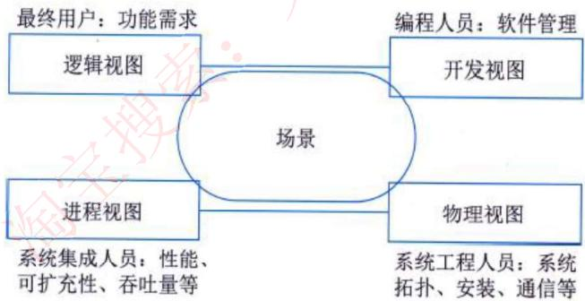
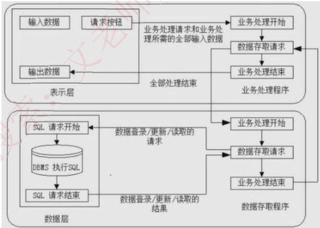
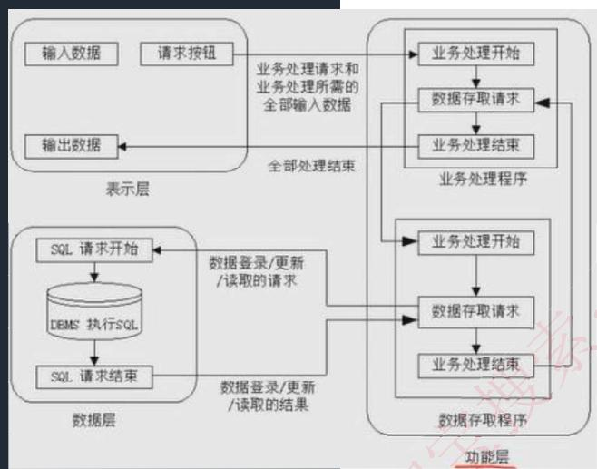
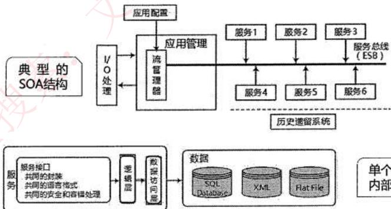
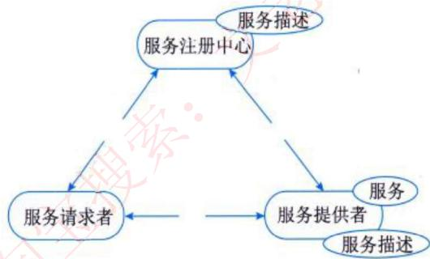
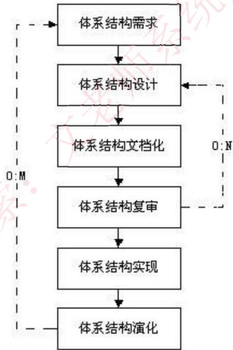
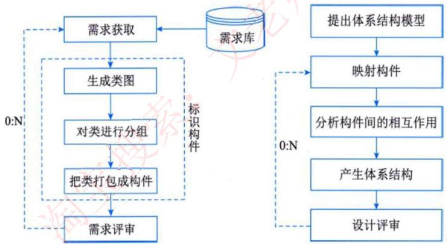
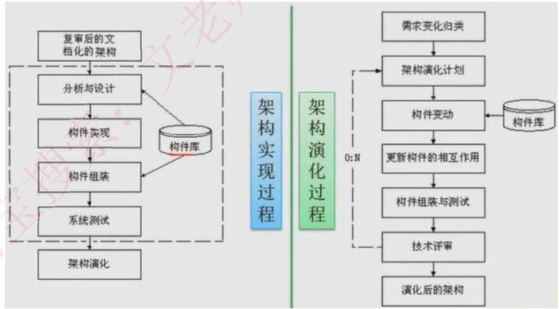

# 软件架构设计

> **考试重点**：从2023年开始考察，选择题占3-5分，2024年有3个关于架构的论文题，建议重点学习。

## 1 软件架构概述

### 1.1 软件架构定义

**软件架构**：在软件需求和设计之间存在一条很难逾越的鸿沟，软件架构作为桥梁，重点解决系统结构和需求向实现平稳过渡的问题。

软件架构为软件系统提供了一个结构、行为和属性的高级抽象，由构件的描述、构件的相互作用（连接件）、指导构件集成的模式以及这些模式的约束组成。

### 1.2 软件架构的意义

1. **架构是项目干系人进行交流的手段**
2. **架构是早期设计决策的体现**
3. **架构明确了对系统实现的约束条件**
4. **架构决定了开发和维护组织的组织结构**
5. **架构制约着系统的质量属性**
6. **架构使推理和控制更改更简单**
7. **架构有助于循序渐进的原型设计**
8. **架构可以作为培训的基础**
9. **架构是可传递和可复用的模型**

## 2 软件架构建模

### 2.1 软件架构技术发展阶段

| 阶段 | 特征 |
|------|------|
| **无架构设计阶段** | 以汇编语言进行小规模应用程序开发 |
| **萌芽阶段** | 出现程序结构设计主题，以控制流图和数据流图构成软件结构 |
| **初级阶段** | 出现从不同侧面描述系统的结构模型，以UML为典型代表 |
| **高级阶段** | 以描述系统的高层抽象结构为中心，以"4+1"模型为标志 |

### 2.2 软件架构模型分类

| 模型类型 | 说明 |
|---------|------|
| **结构模型** | 最直观和最普遍的建模方法，以构件、连接件和其他概念来刻画架构 |
| **框架模型** | 不太侧重描述结构的细节而更侧重于整体结构 |
| **动态模型** | 对结构模型或框架模型的补充，研究系统的粗粒度行为性质 |
| **过程模型** | 研究构建系统的步骤和过程 |
| **功能模型** | 认为架构是由一组功能构件按层次组成的，下层向上层提供服务 |

### 2.3 "4+1"视图模型

| 视图       | 说明                                | UML对应 |
| -------- | --------------------------------- | ----- |
| **逻辑视图** | 支持系统的功能需求，即系统提供给最终用户的服务           | 类图    |
| **开发视图** | 也称为模块视图，侧重于软件模块的组织和管理             | 实现视图  |
| **进程视图** | 侧重于系统的运行特性，关注并发性、分布性、系统集成性和容错能力   | -     |
| **物理视图** | 考虑如何把软件映射到硬件上，考虑系统拓扑结构、系统安装和通信等问题 | 部署视图  |
| **场景**   | 重要系统活动的抽象，使4个视图有机联系起来             | 用例视图  |

## 3 软件架构风格

### 3.1 架构风格概述

**软件体系结构风格**：描述某一特定应用领域中系统组织方式的惯用模式。架构风格定义一个系统家族，即一个架构定义、一个词汇表和一组约束。

架构风格反映了领域中众多系统所共有的结构和语义特性，并指导如何将各个模块和子系统有效地组织成一个完整的系统。

### 3.2 数据流风格

| 风格 | 说明 | 特点 |
|------|------|------|
| **批处理序列** | 构件为一系列固定顺序的计算单元，构件之间只通过数据传递交互 | 每个处理步骤是独立的程序，数据必须是完整的，以整体方式传递 |
| **管道-过滤器** | 每个构件都有一组输入和输出，构件读取输入的数据流，经过内部处理，产生输出数据流 | 前一个构件的输出作为后一个构件的输入，过滤器是构件，管道是连接件 |

**区别**：
- 批处理前后构件不一定有关联，必须前一个执行完才能执行下一个
- 管道-过滤器前面执行到部分可以开始下一个的执行

**应用**：早期编译器采用这种架构

### 3.3 调用/返回风格

| 风格 | 说明 |
|------|------|
| **主程序/子程序** | 单线程控制，把问题划分为若干个处理步骤，过程调用作为交互机制 |
| **面向对象** | 构件是对象，对象是抽象数据类型的实例，通过函数和过程的调用来交互 |
| **层次结构** | 构件组成一个层次结构，每层为上一层提供服务，使用下一层的服务 |

**层次结构优点**：
1. 支持基于可增加抽象层的设计，允许将复杂问题分解成增量步骤序列
2. 不同的层次处于不同的抽象级别，越靠近底层，抽象级别越高
3. 每层最多只影响两层，为软件复用提供了强大的支持

**层次结构缺点**：
1. 并不是每个系统都可以很容易地划分为分层的模式
2. 很难找到一个合适的、正确的层次抽象方法

### 3.4 独立构件风格

| 风格         | 说明                                           |
| ---------- | -------------------------------------------- |
| **进程通信**   | 构件是独立的进程，连接件是消息传递，可以是点对点、异步或同步方式，以及远程过程调用    |
| **事件驱动系统** | 构件不直接调用一个过程，而是触发或广播一个或多个事件，系统自动调用在事件中注册的所有过程 |

**事件驱动系统优点**：
- 为软件复用提供了强大的支持
- 为构件的维护和演化带来了方便

**事件驱动系统缺点**：
- 构件放弃了对系统计算的控制

### 3.5 虚拟机风格

| 风格          | 说明                                                          |
| ----------- | ----------------------------------------------------------- |
| **解释器**     | 包括解释引擎、包含将被解释的代码的存储区、记录解释引擎当前工作状态的数据结构，以及记录源代码被解释执行的进度的数据结构 |
| **基于规则的系统** | 包括规则集、规则解释器、规则/数据选择器和工作内存，一般用在人工智能领域和DSS中                   |

**解释器缺点**：执行效率低

### 3.6 仓库风格（以数据为中心）

| 风格 | 说明 |
|------|------|
| **数据库系统** | 仓库是存储和维护数据的中心场所，中央数据结构说明当前数据的状态，以及一组对中央数据进行操作的独立构件 |
| **黑板系统** | 适用于解决复杂的非结构化问题，包括知识源、黑板和控制三部分 |

**黑板系统组成**：
- **知识源**：包括若干独立计算的不同单元，提供解决问题的知识
- **黑板**：全局数据库，包含问题域解空间的全部状态，是知识源相互作用的唯一媒介
- **控制**：知识源响应通过黑板状态的变化来控制

**应用**：信号处理、问题规划和编译器优化等

**现代编译器**：集成开发环境一般采用数据仓库架构风格，中心数据是程序的语法树。

## 4 层次架构风格

### 4.1 两层C/S架构

**缺点**：
- 开发成本较高
- 客户端程序设计复杂
- 信息内容和形式单一
- 用户界面风格不一
- 软件移植困难
- 软件维护和升级困难
- 新技术不能轻易应用
- 安全性问题
- 服务器端压力大难以复用

### 4.2 三层C/S架构

**组成**：
- **表示层**：在客户机上
- **功能层**：在应用服务器上
- **数据层**：在数据库服务器上

**优点**：
1. 各层在逻辑上保持相对独立，整个系统的逻辑结构更为清晰
2. 允许灵活有效的选用相应的平台和硬件系统，具有良好的可升级性和开放性
3. 各层可以并行开发，各层也可以选择各自最适合的开发语言
4. 功能层有效的隔离表示层与数据层，为严格的安全管理奠定了坚实的基础

**设计关键**：各层之间的通信效率，要慎重考虑三层间的通信方法、通信频度和数据量

### 4.3 B/S架构

**特点**：三层C/S架构的变种，将客户端变为浏览器，将应用服务器变为Web服务器，又称为0客户端架构

**缺点**：
- 缺乏对动态页面的支持能力，没有集成有效的数据库处理功能
- 安全性难以控制
- 在数据查询等响应速度上，要远远低于C/S架构
- 数据提交一般以页面为单位，数据的动态交互性不强，不利于OLTP应用

### 4.4 混合架构风格

| 模型         | 说明                    |
| ---------- | --------------------- |
| **内外有别模型** | 企业内部使用C/S，外部人员访问使用B/S |
| **查改有别模型** | 采用B/S查询，采用C/S修改       |

**缺点**：实现困难，且成本高

## 5 面向服务的架构风格（SOA）

### 5.1 SOA概述

**SOA**：一种粗粒度、松耦合服务架构，服务之间通过简单、精确定义接口进行通信，不涉及底层编程接口和通信模型。

### 5.2 SOA特征

| 特征               | 说明                                    |
| ---------------- | ------------------------------------- |
| **明确定义的接口**      | 服务定义必须长时间稳定，一旦公布，不能随意更改               |
| **自包含和模块化**      | 服务封装了那些在业务上稳定、重复出现的活动和构件              |
| **粗粒度**          | 服务数量不应该太多，依靠消息交互而不是远程过程调用             |
| **松耦合**          | 服务请求者可见的是服务的接口，其位置、实现技术、当前状态和私有数据等不可见 |
| **互操作性、兼容和策略声明** | 确保服务规约的全面和明确                          |

### 5.3 服务构件与传统构件的区别

| 对比项     | 服务构件           | 传统构件        |
| ------- | -------------- | ----------- |
| **粒度**  | 粗粒度            | 细粒度居多       |
| **接口**  | 标准的，主要是WSDL接口  | 常以具体API形式出现 |
| **实现**  | 与语言无关          | 常绑定某种特定的语言  |
| **QoS** | 通过构件容器提供QoS的服务 | 完全由程序代码直接控制 |

### 5.4 SOA相关技术

| 技术       | 说明                                      |
| -------- | --------------------------------------- |
| **UDDI** | 用于Web服务注册和服务查找，描述了服务的概念，定义了编程的接口        |
| **WSDL** | 对服务进行描述的语言，包含服务实现定义和服务接口定义              |
| **SOAP** | 简单对象访问协议，基于XML的消息传递协议                   |
| **REST** | 表述性状态转移，使用HTTP标准方法（POST、GET、PUT、DELETE） |

**SOAP消息组成**：
1. **Envelope**：XML SOAP消息中必须出现
2. **Header**：SOAP机制
3. **Body**：SOAP消息主体

**REST概念和准则**：
1. 网络上的所有事物都被抽象为资源
2. 每个资源对应一个唯一的资源标识
3. 通过通用的连接件接口对资源进行操作
4. 对资源的各种操作不会改变资源标识
5. 所有的操作都是无状态的

### 5.5 Web Service模型

| 角色 | 说明 |
|------|------|
| **服务提供者** | 服务的所有者，负责定义并实现服务，使用WSDL对服务进行描述，并将该描述发布到服务注册中心 |
| **服务请求者** | 服务的使用者，程序的最终使用者仍然是用户 |
| **服务注册中心** | 连接服务提供者和服务请求者的纽带，可选 |

**Web Service操作**：发布、查找和绑定

### 5.6 Web Service协议栈

| 层次 | 功能 | 标准 |
|------|------|------|
| **传输层** | 消息传输协议 | HTTP、JMS、SMTP |
| **服务通信协议层** | 描述并定义服务之间进行消息传递所需的技术标准 | SOAP、REST |
| **服务描述层** | 以统一的方式描述服务的接口与消息交换方式 | WSDL |
| **服务层** | 将遗留系统进行包装，并通过发布的WSDL接口描述来定位和调用服务 | - |
| **业务流程层** | 支持服务发现，服务调用和点到点的服务调用 | WSBPEL |
| **服务注册层** | 使服务提供者能够通过WSDL发布服务定义 | UDDI |

### 5.7 企业服务总线（ESB）

**ESB**：提供了一种基础设施，消除了服务请求者与服务提供者之间的直接连接，使得服务请求者与服务提供者之间进一步解耦。

**ESB功能**：
1. 支持异构环境中的服务、消息和基于事件的交互
2. 在几乎不更改代码的情况下，以一种无缝的非侵入方式使现有系统具有全新的服务接口
3. 充当缓冲器，负责在诸多服务之间转换业务逻辑和数据格式
4. 提供诸如服务代理和协议转换等功能
5. 提供可配置的消息转换翻译机制和基于消息内容的消息路由服务
6. 提供安全和拥有者机制，以保证消息和服务使用的认证、授权和完整性

**ESB优势**：
1. 扩展的、基于标准的连接
2. 灵活的、服务导向的应用组合
3. 提高复用率，降低成本
4. 减少市场反应时间，提高生产率

## 6 软件架构标准

### 6.1 IEEE 1471-2000标准

**标准要素**：

| 要素                 | 说明                              |
| ------------------ | ------------------------------- |
| **任务**             | 一种使用或操作，是一个系统想要满足一名或多名利益相关者的目标  |
| **环境、系统以及架构**      | 一个完整的系统是由一系列组件组成的，系统存在于环境之中     |
| **利益相关者、架构说明以及原理** | 一个系统拥有多个利益相关者，系统架构需要架构说明来进行描述   |
| **关注、关注点、视图**      | 一个系统的利益相关者对系统和与其有关的问题进行关注       |
| **关注点库、模型**        | 关注点库中存放了前人总结出来的观察点，模型是用来表示视图的方法 |

## 7 基于架构的软件开发

### 7.1 开发过程

### 7.2 六个步骤

#### （1）架构需求

**需求获取**：体系结构需求一般来自三个方面：
- 系统的质量目标
- 系统的商业目标
- 系统开发人员的商业目标

**标识构件**：为系统生成初始逻辑结构，标识大致的构件

#### （2）架构设计

将需求阶段的标识构件映射成构件，进行分析

#### （3）架构文档化

主要产出两种文档：
- 架构规格说明
- 测试架构需求的质量设计说明书

文档是至关重要的，是所有人员通信的手段，关系开发的成败。

#### （4）架构复审

由外部人员（独立于开发组织之外的人，如用户代表和领域专家等）参加的复审，复审架构是否满足需求，质量问题，构件划分合理性等。

#### （5）架构实现

用实体来显示出架构，实现构件，构件组装成系统。

#### （6）架构演化

对架构进行改变，按需求增删构件，使架构可复用。

## 8 软件系统的质量属性

### 8.1 开发期质量属性

| 属性 | 说明 |
|------|------|
| **易理解性** | 设计被开发人员理解的难易程度 |
| **可扩展性** | 软件因适应新需求或需求变化而增加新功能的能力，也称为灵活性 |
| **可重用性** | 重用软件系统或某一部分的难易程度 |
| **可测试性** | 对软件测试以证明其满足需求规范的难易程度 |
| **可维护性** | 当需要修改缺陷、增加功能、提高质量属性时，识别修改点并实施修改的难易程度 |
| **可移植性** | 将软件系统从一个运行环境转移到另一个不同的运行环境的难易程度 |

### 8.2 运行期质量属性

| 属性 | 说明 |
|------|------|
| **性能** | 软件系统及时提供相应服务的能力，如速度、吞吐量和容量等的要求 |
| **安全性** | 软件系统同时兼顾向合法用户提供服务，以及阻止非授权使用的能力 |
| **可伸缩性** | 当用户数和数据量增加时，软件系统维持高服务质量的能力 |
| **互操作性** | 本软件系统与其他系统交换数据和相互调用服务的难易程度 |
| **可靠性** | 软件系统在一定的时间内持续无故障运行的能力 |
| **可用性** | 系统在一定时间内正常工作的时间所占的比例 |
| **鲁棒性** | 软件系统在非正常情况下仍能够正常运行的能力，也称健壮性或容错性 |

## 9 软件架构评估

### 9.1 质量属性详解

#### 性能

**定义**：系统的响应能力，即要经过多长时间才能对某个事件做出响应，或者在某段时间内系统所能处理的事件的个数。

**度量**：响应时间、吞吐量

**设计策略**：
- 优先级队列
- 增加计算资源
- 减少计算开销
- 引入并发机制
- 采用资源调度

#### 可靠性

**定义**：软件系统在应用或系统错误面前，在意外或错误使用的情况下维持正常运行的能力。

**度量**：MTTF（平均失效时间）、MTBF（平均故障间隔时间）、MTTR（平均修复时间）

**设计策略**：Ping/Echo

#### 可用性

**定义**：系统能够正常运行的时间比例，经常用两次故障之间的时间长度或在出现故障时系统能够恢复正常的速度来表示。

**度量**：故障间隔时间

**设计策略**：Ping/Echo

#### 安全性

**定义**：系统在向合法用户提供服务的同时能够阻止非授权用户使用的企图或拒绝服务的能力。

**度量**：保密性、完整性、不可抵赖性、可控性

**设计策略**：
- 入侵检测
- 用户认证
- 用户授权
- 追踪审计

#### 可修改性

**定义**：能够快速的以较高的性能价格比对系统进行变更的能力。

**设计策略**：
- 接口-实现分类
- 抽象
- 信息隐藏

### 9.2 质量属性场景

**质量属性场景**：一种面向特定质量属性的需求，由6部分组成：

| 组成部分 | 说明 |
|---------|------|
| **刺激源** | 生成该刺激的实体（人、计算机系统或者任何其他刺激器） |
| **刺激** | 当刺激到达系统时需要考虑的条件 |
| **环境** | 该刺激在某些条件内发生，当激励发生时，系统可能处于过载、运行或者其他情况 |
| **制品** | 某个制品被激励，可能是整个系统，也可能是系统的一部分 |
| **响应** | 系统对刺激的响应 |
| **响应度量** | 当响应发生时，应当能够以某种方式对其进行度量，以对需求进行测试 |

**可修改性质量属性场景示例**：

| 场景要素 | 可能的情况 |
|---------|-----------|
| **刺激源** | 最终用户、开发人员、系统管理员 |
| **刺激** | 希望增加、删除、修改、改变功能、质量属性、容量等 |
| **环境** | 系统设计时、编译时、构建时、运行时 |
| **制品** | 系统用户界面、平台、环境或与目标系统交互的系统 |
| **响应** | 查找架构中需要修改的位置，进行修改且不会影响其他功能，对所做的修改进行测试，部署所做的修改 |
| **响应度量** | 根据所影响元素的数量度量的成本、努力、资金；该修改对其他功能或质量属性所造成影响的程度 |

## 10 考试真题精选

### 真题1：架构风格定义

软件架构风格是描述某一特定应用领域中系统组织方式的惯用模式。架构风格反映领域中众多系统所共有的结构和（语义特性），强调对架构（设计决策）的重用。

> **答案**：语义特性、设计决策

### 真题2：架构风格与系统性能

以下关于软件架构风格与系统性能的关系叙述中，错误的是（C）。

A. 对于采用层次化架构风格的系统，划分的层次越多，系统的性能越差
B. 对于采用隐式调用架构风格的系统，可以通过处理函数的并发调用提高系统处理性能
C. 采用面向对象架构风格的系统，可以通过引入对象管理层提高系统性能
D. 对于采用解释器架构风格的系统，可以通过部分解释代码预先编译的方式提高系统性能

> **解析**：引入对象管理层不但不能提高性能，反而会降低系统性能。这个道理与分层模型中增加层次是一样的。

### 真题3：编译器架构风格

某公司拟为某种新型可编程机器人开发相应的编译器。该编译过程包括词法分析、语法分析、语义分析和代码生成四个阶段，每个阶段产生的结果作为下一个阶段的输入，且需独立存储。针对上述描述，该集成开发环境应采用（A）架构风格最为合适。

A. 管道-过滤器
B. 数据仓库
C. 主程序-子程序
D. 解释器

> **解析**："每个阶段产生的结果作为下一个阶段的输入"是典型的数据流架构风格的特点，选项中，仅有管道-过滤器属于这种风格。

### 真题4：业务组合架构风格

某企业内部现有的主要业务功能已封装成为Web服务。为了拓展业务范围，需要将现有的业务功能进行多种组合，形成新的业务功能。针对业务灵活组合这一要求，采用（D）架构风格最为合适。

A. 规则系统
B. 面向对象
C. 管道-过滤器
D. 解释器

> **解析**：根据题意，要求对业务功能灵活组合形成新的业务功能，就是有自定义类型的业务。自定义的业务能正常执行，需要有虚拟机架构的支撑。目前备选答案中A与D都是虚拟机风格。而A主要适合于专家系统，所以应选D。

### 真题5：在线交易网站质量属性

某公司欲开发一个在线交易网站，在架构设计阶段，公司的架构师识别出3个核心质量属性场景：

1. "网站正常运行时，用户发起的交易请求应该在3秒内完成"主要与（性能）质量属性相关，通常可采用（资源调度）架构策略实现该属性
2. "在线交易主站宕机后，能够在3秒内自动切换至备用站点并恢复正常运行"主要与（可用性）质量属性相关，通常可采用（心跳/Ping-Echo）架构策略实现该属性
3. "系统应该具备一定的安全保护措施，从而能够抵挡恶意的入侵破坏行为，并对所有针对网站的攻击行为进行报警和记录"主要与（安全性）质量属性相关，通常可采用（入侵检测）架构策略实现该属性

> **答案**：性能、资源调度；可用性、心跳/Ping-Echo；安全性、入侵检测

---

## 参考资源

- 系统分析师教材（第二版）第12章
- 文老师软考教育