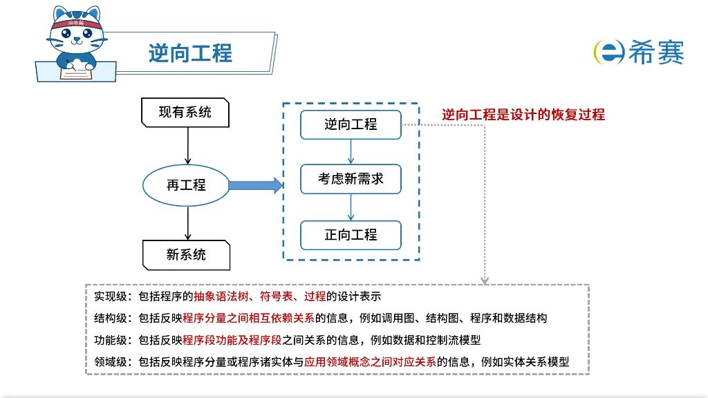
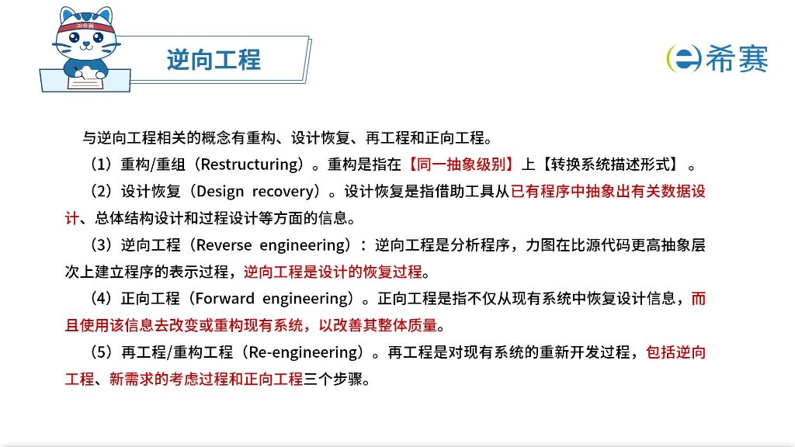
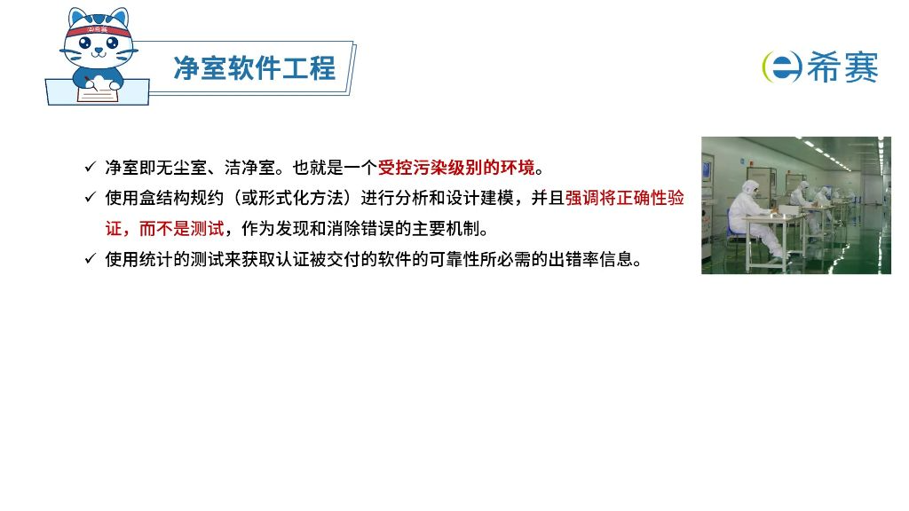
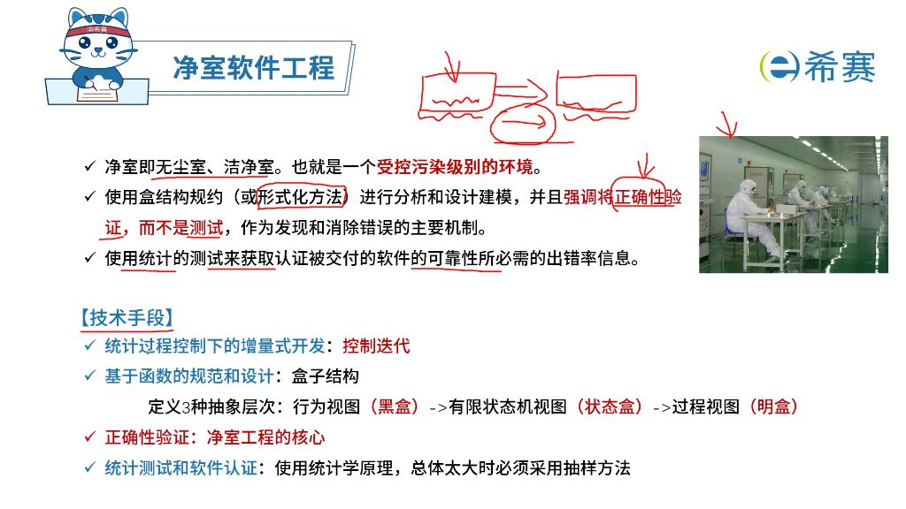

## 概述

## 软件过程模型
## 瀑布模型

特点

缺点

## 原型模型

适合需求不明确的项目

## 原型相关模型

## V模型

测试贯穿始终

测试分阶段，测试计划提前

## 迭代与增量

## 螺旋模型

## 构件组装模型

优点 易扩展 易重用 降低成本 安排任务灵活

缺点

## 基于构件的软件工程（CBSE）

特征

- 可组装性: 所有外部交互必须通过公开定义的接口进行（如USB标准接口），体现接口标准化思想。
- 可部署性: 构件以二进制形式存在，能作为独立实体在平台上运行，强调独立运行能力。
- 文档化: 用户通过文档判断构件是否满足需求，是构件使用的重要依据。
- 独立性: 构件可在无需其他特殊构件的情况下进行组装和部署，与可部署性相关但侧重不同。
- 标准化: 必须符合某种标准化的构件模型（如DNA模型、CORBA等），标准化思想贯穿CBSE全过程。

构件的组装

- 顺序组装
    - 实现方式: 按标准业务流程顺序调用已有构件，用多个构件组合成新构件。
    - 应用示例: 类似乐高积木拼接，或方舱医院中箱体、呼吸机系统、负压系统等构件的顺序组合。
- 层次组装
    - 核心要求: 被调用构件的"提供"接口必须与调用构件的"请求"接口兼容。
    - 特点: 强调分层结构中接口的匹配性，不同于顺序组装的时间先后关系。
- 叠加组装
    - 实现方式: 多个构件合并形成新构件，整合原构件功能后对外提供新接口。
    - 特点: 不强调时间顺序或层次关系，重点在于功能整合与接口重构。

## 快速应用开发模型（RAD）

## 统一过程

UP(Unified Process)或RUP(Rational Unified Process)

## 敏捷方法概述

## 敏捷方法

## 逆向工程

## 净室软件工程

## 需求工程概述

## 需求获取-需求分类

## 需求获取-需求获取方法

## 结构化需求分析

  ## UML基本概念
  

## UML 4加1视图

## 需求定义

## 需求验证

## 需求跟踪

## 需求变更管理

## 软件系统建模
      

## 人机界面设计

## 结构化设计

## 面向对象设计

## 面向对象设计（类的分类）

## 软件测试

## 软件测试阶段

## 系统转换计划

新旧系统的转换策略

## 软件维护

